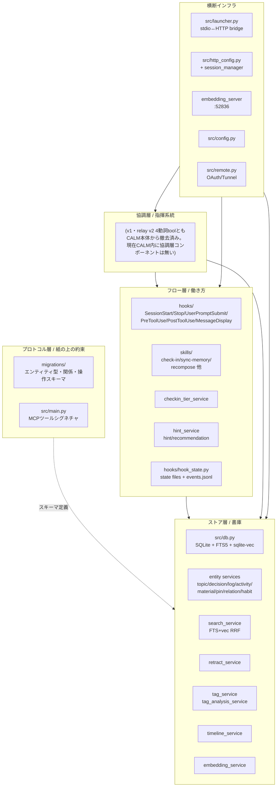
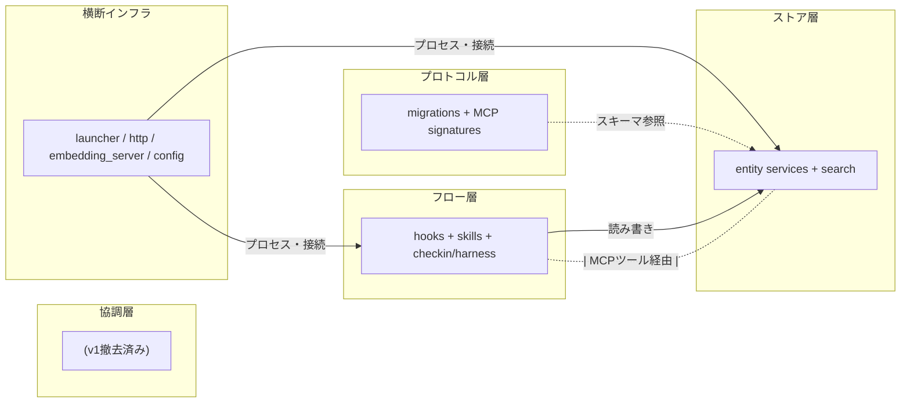

<!-- ccm-doc-sync
watch-tags: domain:calm, domain:cc-memory
watch-direction: true
watch-migrations: false
last-synced: 2026-09-23
last-synced-migration: 0077
-->

# CALM コンポーネント構成図 v0

## 0. 読み方

本ドキュメントはCALM（広義）の実装コンポーネントを、`docs/spec-v0.md` の4層スタック（プロトコル/ストア/フロー/協調）に沿って写し取った構成図である。仕様凍結を目的としない。一次情報はリポジトリ構造とコードであり、本ドキュメントはその「実装側の写し取り」であって、コードと食い違った場合はコードが正である。

`docs/spec-v0.md` が「概論・地図」で抽象モデルを示し、本ドキュメントは同じ4層を実コンポーネント名に落として示す。「どこで何が動いているか」をコードを開かずに把握できることを優先する。

CALM内部ID（D#/M#/A#/L#/T#）は本文に出さず論理名で書く。一方、コードベース上のモジュール名・ファイル名は外部参照可能なので出す。

---

## 1. 全体像



層は独立に差し替え可能という設計方針（`docs/spec-v0.md` §1）に沿って、層内の依存はストア層 → プロトコル層（スキーマ参照）の片方向、フロー層・協調層はストア層を読み書きする利用者、横断インフラは全層に横たわるという構成になっている。

---

## 2. プロトコル層 — 紙の上の約束

プロトコル層はエンティティ型・関係・操作のセマンティクスを定義する層で、CALMのコードベースには「層として独立したモジュール」は存在しない。代わりに以下の場所にセマンティクスが分散して埋め込まれている。

### 2.1 スキーマの実体

- `migrations/0001_initial_schema.sql` 〜 `migrations/0039_*` 系: テーブル・インデックス・トリガー定義。エンティティ型（topics / decisions / discussion_logs / activities / materials / pins / relations / habits / tags / tag_canonicals）と関係（supersedes / depends_on / pin / relation）のスキーマはここに具現化されている
- `migrations/0033_relation_expansion.sql`, `migrations/0034_pins_directed_relation.sql`: 関係の汎化と方向性導入
- `migrations/0009_tag_infrastructure.sql`, `migrations/0014_intent_namespace.sql`, `migrations/0015_tag_canonical.sql`, `migrations/0024_tag_description.sql`, `migrations/0039_extend_tag_namespace.sql`, `migrations/0039_intent_thinking.sql`: タグ名前空間と二段防御（tag_canonicals）。なお `0039_*.sql` は番号重複（`docs/spec/db-schema.md` §7 を参照）

### 2.2 操作の実体

- `src/main.py`: FastMCPでMCPツールシグネチャを定義する。`add_topic` / `add_decisions` / `add_logs` / `add_activity` / `add_material` / `add_pin` / `add_relation` / `update_*` / `retract` / `search` / `get_*` / `check_in` などの操作のIFはここで宣言される
- `src/main.py` 冒頭の `RULES` 定数: MCP serverのinstructions（利用ガイド）を文字列で持つ。プロトコルの意味論をAIへ伝える「文面の規律」（`docs/spec-v0.md` §6 T-A）の入口

### 2.3 ライフサイクル操作

- `src/services/retract_service.py`: 論理削除（retracted_atを立てる）の集約点。エンティティ別の物理削除波及（search_indexのクリーンアップ等）は未確認の領域があり、`docs/spec-v0.md` §2.2 のretract/supersedesライフサイクル節で「論理削除の連鎖が閉じていない」と指摘されている
- supersedes・depends_on・pinといった「関係としての操作」は `src/services/relation_service.py` / `src/services/pin_service.py` に集約される

### 2.4 未確認領域

- プロトコル層に対応する独立した型定義（models/やschemas/）は本リポでは見当たらない。エンティティ型はDBスキーマと各serviceの返却dict形状で表現されている。型レベルでの規律は弱いと推察される（要検証）

---

## 3. ストア層 — CALM（狭義）

ストア層は「データの保持と読み出し」を担う。`src/services/` がほぼそのまま層に対応する。「読まれること」が仕事である。

### 3.1 永続化基盤

- `src/db.py`: SQLite接続・yoyoによるマイグレーション実行・sqlite_vec拡張ロード
- `src/config.py`: DB_PATH等の環境設定
- 永続化先のDB実体は `~/.claude/.claude-code-memory/discussion.db`（auto-memoryに記録あり）

### 3.2 エンティティ別 service

役割は「単一エンティティのCRUD + そのエンティティ固有のクエリ」。

| service | 担当エンティティ |
|---|---|
| `topic_service` | topics |
| `decision_service` | decisions（supersedes含む） |
| `discussion_log_service` | discussion_logs |
| `activity_service` | activities（status遷移、depends_on含む） |
| `material_service` | materials |
| `pin_service` | pins（directed relation） |
| `relation_service` | relations（双方向関連の汎化） |
| `habit_service` | habits（正はDB、`~/.claude/rules`配下の自動生成ファイルへ投影配信） |
| `tag_service` | tags / tag_canonicals / tag_notes |
| `ask_service` | asks（判断委譲。open→answered→promoted/dismissed、open→withdrawnの状態遷移） |
| `goal_service` | goals / goal_conditions / goal_activities（activityの終了条件） |
| `overview_service` | 4節の窓を集計する読み取り専用サービス（activities / asks横断） |

### 3.3 横断クエリ・読み出し

- `src/services/search_service.py`: FTS5検索（`_fts_search`）+ ベクトル検索（`_vector_search`）の RRF（Reciprocal Rank Fusion）合成、recency boost、適応的重み（`_compute_adaptive_weights`）、タグフィルタCTE（`_build_tag_filter_cte`）、`get_by_id` / `get_by_ids` の詳細取得を提供する
- `src/services/timeline_service.py`: 時系列ビュー（`get_timeline`）
- `src/services/retract_service.py`: 論理削除と検索からの除外（NOT EXISTSによるretract遅延除外）
- `src/services/tag_analysis_service.py`: タグ共起分析（`analyze_tags`）。tag-cleanupスキルから利用
- `src/services/destabilization_service.py`: destabilizesエッジの解消（`resolve_destabilization`）・候補提示（`suggest_destabilized_candidates`）
- `src/services/supersede_service.py`: `decision_supersedes`を辿ったsupersedeチェーン算出のヘルパー。precedent系・direction_service・decision_service・checkin_service・search_service等decisionを扱う多数のserviceから共有される
- `src/services/precedent_pull_service.py`: `pull_precedents`のtopic routing + browse保証（近傍topicの非retract decisionをLIMIT無しで網羅列挙）
- `src/services/precedent_cluster_service.py`: `precedent_pull_service`から呼ばれ、seed decision集合をsupersede系譜／depth-1のrelatedエッジ／depth-1のcitationエッジで連結クラスタ展開する
- `src/services/budget_service.py`: `pull_precedents`の予算配分ロジックと、decision/logページネーション用件数カウントの共通プリミティブ
- `src/services/signal_service.py`: signal_events（CALM自身の故障・使用感不満等の生観測データ）のCRUD
- `src/services/session_registry_service.py`: セッション別名（CLI表示名↔人間可読別名）対応表の読み書き
- `src/services/delta_service.py`: check_in時にスナップショットしたtopicスコープ以降に追加されたdecision/log/materialを取得する純粋クエリ関数群。watermark（既読位置）自体はin-memoryで`src/middleware/delta_middleware.py`が管理する（サーバー再起動でwipeされ次のcheck_inで再ベースライン）
- `src/services/staleness_service.py`: supersede chainの推移的なhead算出と鮮度メタデータ付与。`direction_service`から呼ばれ方向性decisionの陳腐化把握に使われる
- `src/services/citation_renderer.py`（+ `citations_service.py` / `citations_pure.py`）: flavor引数（raw/internal/readable）に応じたcitationテンプレート・削除済み参照の展開
- `src/services/direction_service.py`: `layer:direction`decisionの非ランク網羅列挙。`hint_service`のdirection_overflow判定と`add_decisions`のexisting_direction_decisions/direction_noteの土台
- `src/services/reask_detection_service.py`: `detect_reask_candidates`のtranscript抽出ロジック
- `src/services/restart_service.py`: cc-memory MCPサーバー・embeddingサーバーの強制再起動（`calm:restart` skillから利用）
- `src/services/backup_service.py`: DBスナップショットの取得・ヘルスチェック・ローテーション・復元

### 3.3b エクスポート・インポート基盤

他インスタンスへの記録の受け渡し（`docs/spec/mcp-tools.md` §1.9）を担う。

- `src/services/instance_service.py`: 自インスタンス識別子（`set_instance_identity`）の設定・複合キー発行の基盤
- `src/services/export_candidate_service.py`: export候補の走査・提示（`collect_export_candidates`、read-only）
- `src/services/export_bundle_service.py`: 確定候補からのバンドル書き出し（`export_bundle`、manifest.yaml + エンティティ別mdファイル）
- `src/services/import_bundle_service.py`: バンドルの取り込み（`import_bundle`、dry_run衝突検知 / apply実書き込み）

### 3.4 埋め込み

- `src/services/embedding_service.py`: アプリ側からembedding取得を呼ぶクライアント
- `src/infra/embedding_server.py`: モデル保持・encodeを1プロセスに集約するHTTPサーバー（localhost:52836、リクエストTTL 3600秒/drain idle 30秒/drain deadline 1800秒でgraceful shutdown、いずれもenv varで調整可、モデル `cl-nagoya/ruri-v3-70m`）。横断インフラ寄りだが本体はストア層が読むため §3 にも記載

### 3.5 公開IF

ストア層の公開IFは `src/main.py` のMCPツールである。MCP toolsはストア層 servicesの薄いラッパとして動作するものが多く（例: `add_topic` → `topic_service.create`）、`check_in` / `search` のように複数service横断・計算ロジックを持つものはservice側に集約されている。

### 3.6 既知の課題

- 5次元統合レポート（cc-memory material 312、要参照）が指摘するサービス膨張・共通パターン未抽出（CRUDの定型処理がservice間でコピーされている）
- スコア解釈の不整合（`_apply_recency_boost` による正規化崩れ）。`docs/spec-v0.md` §3.1で言及あり

---

## 4. フロー層 — 働き方

フロー層は「動くこと」を仕事とする。ユーザーやAIの行動に介入し、記録忘れや文脈ロードを駆動する。

### 4.1 hooks/

Claude Code harnessのhookシグナルを受けてプロセスとして起動する一連のスクリプト。登録は `hooks/hooks.json` 経由で管理される。

| hookファイル | 発火タイミング（matcher） | 主な仕事 |
|---|---|---|
| `hooks/hook_state.py`（`clear`サブコマンド） | SessionStart（`*`） | 前セッションの状態ファイルをクリア |
| `hooks/session_start_hook.py` | SessionStart（`*`） | habits投影ファイルの鮮度検証+縮退フォールバック、アクティビティダッシュボード注入、鮮度警告 |
| `hooks/sanitize_backfill_hook.py` | SessionStart（`*`） | 直近transcriptの差分backfill（生ID参照を`{{cite:...}}`へ変換） |
| `hooks/user_prompt_submit_hook.py` | UserPromptSubmit（`*`） | 未消費nudge・ask通知の system-reminder 注入 |
| `hooks/stop_hook.py` | Stop（`*`） | transcript差分抽出→events.jsonl追記、check-in判定、nudge発火判定、heartbeat更新 |
| `hooks/preblock_hook.py` | PreToolUse（`*`） | tool_inputに含まれる内部ID表記のリテラルをblock（`deny`） |
| `hooks/sanitize_tool_result_hook.py` | PostToolUse（`*`。cc-memoryツール以外は素通し） | cc-memory tool_resultの生ID参照を`{{cite:...}}`へ変換して返す |
| `hooks/ask_answer_rewake_hook.py` | PostToolUse（`mcp__.*calm__add_ask`、`asyncRewake`） | `add_ask`直後にaskのstatus変化をポーリングし、回答されたらidleセッションを起こす |
| `hooks/message_display_id_titles.py` | MessageDisplay（`*`） | assistant発話中の内部ID表記の直後にエンティティタイトルを差し込んで表示（表示のみ、transcript/contextは無加工） |

共通基盤:

- `hooks/hook_state.py`: 状態ファイル群（`block_count` / `transcript_offset` / `current_turn` / `checked_in_activity`）と events.jsonl の読み書きを一元化（`HookState` クラス）。永続化先は `~/.claude/.claude-code-memory/state/`
- `hooks/hook_transcript.py`: transcriptの差分抽出
- `hooks/heartbeat.py`: `stop_hook`から呼ばれるheartbeat更新の隔離モジュール（独立したhookイベントではない）
- `hooks/readable_id_format.py` / `hooks/signal_capture.py` / `hooks/citation_event_log.py` / `hooks/ask_notify_section.py`: 上記hookエントリポイントから共通利用されるヘルパーモジュール

### 4.2 skills/

スキル本文（SKILL.md相当）に行動規範を文面として埋め込み、Claude Codeのスキル機構を通じて発動する。

主要スキル群（フロー層に直接寄与するもの）:

- `skills/check-in`: 作業開始時の文脈ロード入り口
- `skills/sync-memory`: セッション終了前の一括記録
- `skills/recompose-context`: タグ・アクティビティの再構成
- `skills/activity-cleanup`: アクティビティの棚卸し（実態確認・処遇判定・反映）
- `skills/setup-anchor`: anchor確定
- `skills/remember`: 記憶要望の保存先振り分け
- `skills/tag-notes` / `skills/tag-cleanup`: タグnotes管理・整理
- `skills/activity-start` / `skills/activity-finish` / `skills/activity-pause`: アクティビティのライフサイクル操作
- `skills/postmortem`: 完了アクティビティの振り返り
- `skills/scribe`: CALM記録からドキュメント生成
- `skills/man`: pull型の使い方説明
- `skills/overview`: 進行状況4節（working/recently_done/awaiting_human/backlog）の窓を呼び出す
- `skills/decision-record`: 合意・未決論点の`add_decisions`記録ガイド
- `skills/recording`: 経緯（log）・成果物（material）の記録判断基準
- `skills/digest`: 期間横断の記録ダイジェスト生成
- `skills/forget`: 陳腐化・矛盾した記録の撤回
- `skills/db-recovery`: DBデータ異常減少の検知〜復旧
- `skills/audit`: 過去decisionの正当性検証・矛盾解消
- `skills/memory-export`: 他インスタンスへ渡すexportバンドルの作成ガイド
- `skills/memory-import`: 他インスタンスのexportバンドルの衝突裁定・取り込みガイド
- `skills/ask-compose` / `skills/ask-answer` / `skills/ask-distill` / `skills/ask-watch`: 判断委譲（asks）の起票構成・回答・同型メタask起票・滞留監視
- `skills/project-setup` / `skills/coding-project-setup`: 新規domainの知識フレームセットアップ
- `skills/restart`: MCPサーバーの強制再起動
- `skills/rule-placement`: 一般化ルールの配信経路（habits/tag-notes/rules等）判定


### 4.3 フロー層 service

- `src/services/checkin_tier_service.py`: check-inの本体実装。アクティビティに紐づく tag-notes・資材カタログ・pinned・関連decisions・recent logs を anchor/control/context/catalog/env の5枠に分けて一括取得し、coverage と recompose hints を計算する (recompose hint は HintService 経由)。`src/services/checkin_service.py` はこのモジュールと差分通知middlewareが共有するクエリヘルパーと`checkin_scope`のみを持つ
- `src/services/hint_service.py`: hint一元化（`get_hints(scope, target_id) -> list[Hint]`）。recompose_bootstrap / recompose_delta / logs_sparse / direction_overflow / activity_cleanup / notes_over_budget を統一フォーマット（`Hint`型）で返す。follow_up_after_decision / record_missingはevents.jsonl状態が必要なため本module自体では判定せず、Stop hookが生成しつつtype名だけ本moduleに合わせて統一する。delivery_hint で immediate (check_in 同期注入) と deferred (Stop hook → events.jsonl → UserPromptSubmit 注入) を分岐する
- `src/services/habit_service.py`: habitのCRUD。書き込み後は`habit_projection`経由で`~/.claude/rules`配下の自動生成ファイルへ投影する。`trigger_mode='always'`は全文、`'intelligently'`はタイトルのみのマニフェストとして投影される

### 4.4 hookシグナルの流れ

```
SessionStart        → hook_state clear / session_start_hook / sanitize_backfill_hook
                       → 状態クリア / アクティビティダッシュボード・鮮度警告注入 / transcript差分backfill
PreToolUse           → preblock_hook → 内部ID表記のtool_inputを検出しblock
PostToolUse          → sanitize_tool_result_hook（cc-memoryツールのみ）→ tool_resultの生ID参照をcitationテンプレへ変換
                       → ask_answer_rewake_hook（add_ask限定、asyncRewake）→ 回答待ちポーリング→idle起床
Stop                 → stop_hook → record_missing / follow_up_after_decision / logs_sparse nudge を events.jsonl に追記
UserPromptSubmit     → user_prompt_submit_hook → 未消費 nudge・ask通知の system-reminder 注入
MessageDisplay       → message_display_id_titles → 内部ID表記の直後にエンティティタイトルを表示注入
```

### 4.5 既知の課題

- nudgeチャネルの増殖（`docs/spec-v0.md` §6 T-C 補完チャネル重複）。事後hint / Stop nudge / harness推奨 / coverage / tag-notes がしきい値・状態管理バラバラで並走
- 「46ターン中16回発火→全て無視→記録ゼロ」の観測知見が `docs/spec-v0.md` §4.2に記録されている

---

## 5. 協調層 — セッション間メッセージング

v1通信系（`ow_service` / `src/relay/`のvendoringされたSSE+SQLite中継サーバー / `scripts/ow/`のrecv系スクリプト）は撤去済みである。後継のrelay v2 4動詞tool（`relay_post` / `relay_publish` / `relay_subscribe` / `relay_receive`）もCALM本体から撤去済みで、`src/services/relay/`ディレクトリごと削除されている。relayサーバー自体は別リポジトリ（isizono/relay）で存続するが、CALM本体としては現在この層に相当するコンポーネントを持たない。呼び出し元セッションの識別子解決（旧relay identity）のみ`src/infra/session_identity.py`へ移設し、ask/セッション別名機能から汎用インフラとして継続利用している。

---

## 6. 横断インフラ

層の外側に横たわる基盤的コンポーネント。

### 6.1 プロセス起動・ブリッジ

- `src/launcher.py`: stdio ↔ HTTPブリッジ。Claude Codeがstdioで接続してくる入口で、HTTPサーバー未起動なら自動でデーモン起動し、stdin JSON-RPCをStreamable HTTP経由で転送する。stdin EOFでセッション解除
- `src/main.py`: FastMCPサーバーエントリ（HTTPモード起動の本体）
- `src/http_config.py`: HTTPサーバー設定
- `src/infra/session_manager.py`: HTTPセッションカウントと自動停止ウォッチドッグ。セッション数0で猶予期間後にshutdown
- `src/infra/staleness_watchdog.py`: セッション数と無関係に、起動時ロードコードとディスク上の内容の乖離（プラグインアップデート）を検知して自死する経路
- `src/infra/lock_file.py`: プロセス間ロック
- `src/infra/cli_session.py`: Claude Code CLIプロセスが公開するsession fileの読み取り専用アクセサ（セッション別名解決の基盤）
- `src/infra/git_repo.py`: git worktree配下からmain repoルートを解決する共有ユーティリティ（`launcher.py` / `restart_service.py`が利用）
- `src/env_compat.py`: 環境変数の新旧名（`CALM_*` / 旧`CCM_*`・`CC_MEMORY_*`）フォールバック解決

### 6.2 リモート公開

- `src/remote.py`: OAuth callback、リモート公開関連
- CLAUDE.local.md記載: Cloudflare Tunnel経由 `https://mcp.isizono.com/mcp`、launchd `com.isizono.cc-memory-remote`

### 6.3 ストレージ周辺ファイル

- DB本体: `~/.claude/.claude-code-memory/discussion.db`
- 状態ファイル群: `~/.claude/.claude-code-memory/state/` 配下に `block_count_<sid>` / `transcript_offset_<sid>` / `current_turn_<sid>` / `checked_in_activity_<sid>` / `events_<sid>.jsonl`（`hooks/hook_state.py` 参照）
- embedding_server: localhost:52836

### 6.4 hooks/utils相当

- `hooks/hook_state.py`: hooksパッケージ内の共通基盤として §4.1 で扱った
- 標準ライブラリのみ依存で書かれており、フロー層のhookから直接importされる

---

## 7. 依存方向



健全な依存方向:

- フロー層 → ストア層（読み書き）
- 全層 → プロトコル層（スキーマ参照）
- 横断インフラ → 全層（プロセス起動・接続管理）

潜在的な循環・癒着:

- フロー層のhookが直接 `src/services/*` をimportする箇所がある（hookプロセスからDB直アクセス）。MCPツール経由ではないため、ストア層のCRUD変更がhookの内部実装に影響しうる
- service間の循環import懸念は5次元統合レポート（material 312、要参照）で指摘されている。本ドキュメントでは具体ファイル間の特定は未実施

---

## 8. 既知の課題

`docs/spec-v0.md` §6 横断テーマと 5次元統合レポート（cc-memory material、要参照）に紐づく、コンポーネント構成上のpain。

1. **サービス膨張**: `src/services/` 配下に20以上のserviceファイルが並び、共通パターン（CRUDの定型処理、タグ付与、retracted_atフィルタ）が未抽出。新エンティティ追加のたびに同型コードが増える
2. **共通パターン未抽出**: search_serviceのSQL組み立て関数群（`_fts_search` / `_vector_search` / `_tag_like_search`）、relation/pin/supersedesの関係メカニズム5系統など、同型ロジックが複数箇所に存在する
3. **circular import懸念**: `src/main.py` から services を読み、 services 同士の相互参照や、tag_serviceとtag_analysis_serviceの分担境界など整理余地がある（具体特定は未実施）
4. **プロトコル層が薄い**: 独立した型/スキーマ定義モジュールがなく、エンティティ型はDBスキーマと各serviceの返却dictで表現される。型レベル規律が弱い
5. **retract連鎖の未完**: `retract_service` が論理削除を立てるが、search_index物理クリーンアップなし、material/topic/activityにretracted_at列なし、関連pin/relationの扱いが未統一（`docs/spec-v0.md` §2.2）
6. **HintService単一窓口の不在**: nudge発火源（hooks/各種、harness_service、checkin_tier_serviceのrecompose hints、tag_service経由のtag-notes）が並走しており、しきい値・状態管理がバラバラ。recompose系・logs_sparse系・direction_overflow系・activity_cleanup系・notes_over_budget系のhintは`hint_service`（`get_hints`/`get_hints_with_conn`）に統一済み（#422、2026-06-21）。ただしfollow_up_after_decision/record_missingはevents.jsonl状態が必要なため引き続きStop hookが個別生成しており、nudge発火源の完全な一元化には至っていない
7. **効果測定基盤の不在**: 検索のスコアリング・nudgeの効果・タグ付与の精度を測定する仕組みがない（`docs/spec-v0.md` §6 T-D）。search_telemetry導入が処方箋候補

各課題の詳細・処方箋候補は5次元統合レポート本文（cc-memory material、要参照）と `docs/spec-v0.md` §6 横断テーマを参照のこと。
