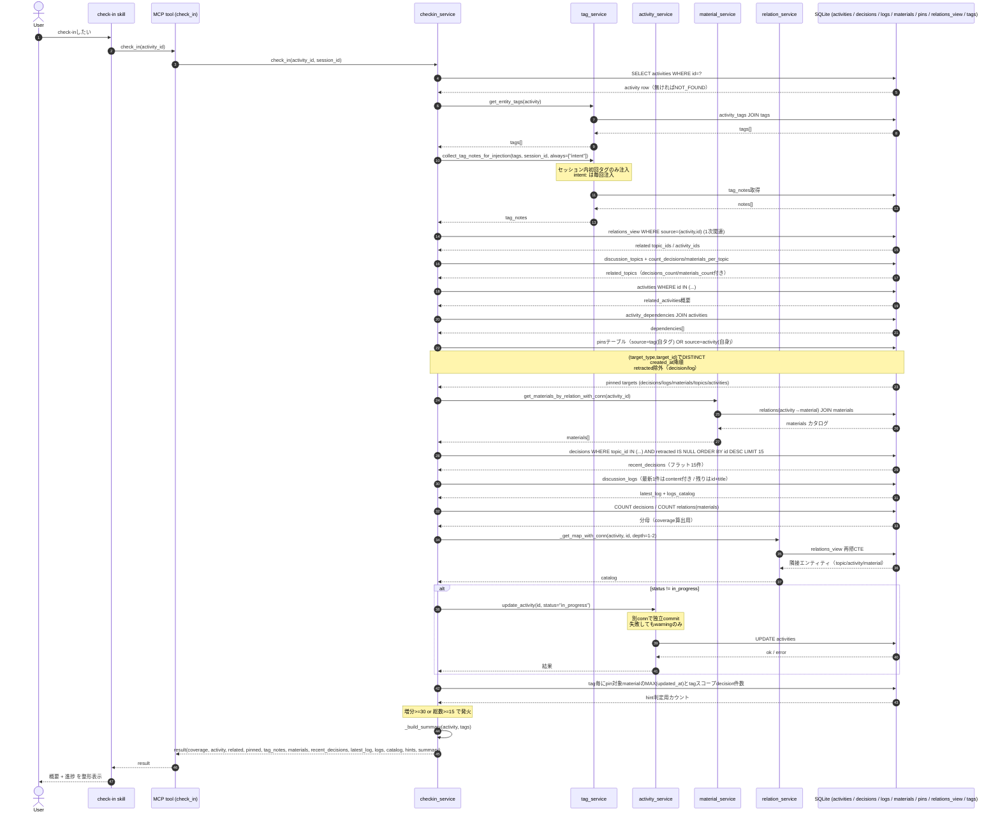

# シーケンス: check-in v0

## 0. 読み方

本書はcc-memoryのcheck-inユースケースの動きを写し取ったシーケンス仕様である。実装の凍結を目的とするものではなく、コードが一次情報であり、本書はその時点の実装を読みやすく整理したスナップショットである。差異を見つけたらコードを正とする。

## 1. 概要

check-inは、特定のアクティビティに紐づいた文脈（関連トピック、決定事項、ログ、資材、pin、タグ、tag_notes、recomposeナッジ）を一括取得し、エージェントが「すぐ作業・議論を開始できる状態」になるためのユースケースである。

- 入口: MCPツール `check_in(activity_id)`（`src/main.py`）
- 呼び出し元: `check-in` スキル、または明示的なエージェント呼び出し
- 主な責務: 関連エンティティの集約取得、status自動更新（in_progress化）、tag_notes注入、coverage算出、recomposeナッジ生成、summary文字列生成
- 副作用: アクティビティのstatusがin_progress以外であればin_progressへ更新される

## 2. 主要シーケンス

## 3. ステップ詳細

1. ユーザーがcheck-inを依頼する。スキルがアクティビティ選択を仲介する場合もある。
2-3. スキルが `check_in(activity_id)` MCPツールを呼び、ツールは `checkin_service.check_in` に委譲する。session_idはMCPコンテキストから取得する。
4-5. activityをSELECTする。存在しなければ `NOT_FOUND` を返して終了する。
6-8. アクティビティのタグを取得する（`activity_tags` JOIN `tags`）。
9-12. tagsをもとに `collect_tag_notes_for_injection` を呼びtag_notesを集める。セッション内初回タグのみ注入されるが、`intent:` namespaceは毎回注入される。
13-14. `relations_view` から直接関連の `topic_ids` / `activity_ids` を取得する。
15-16. 関連topicの基本情報（title）に `count_decisions_per_topic` と `count_materials_per_topic` の結果を結合し、`related_topics` を作る。
17-18. 関連activityの概要（title, status）をバッチ取得する。
19-20. `activity_dependencies` を引いて、依存しているactivityを `dependencies` として返す。
21-23. pinsテーブルを引く。source=tag（このactivityの自タグ）と source=activity（自身）の和を取り、(target_type, target_id) でDISTINCT、created_at降順で並べる。decision/logは `retracted_at IS NULL` でフィルタする。target_type別に `decisions / logs / materials / topics / activities` のキーへ振り分ける（0件キーは省略）。
24-26. `material_service.get_materials_by_relation_with_conn` がactivity直接関連のmaterialカタログを返す。
27-28. 関連topic横断の `recent_decisions` を取得する（retracted除外、ID降順、上限15件）。title優先・decision本文fallback。
29-30. `discussion_logs` から最新1件を content付きで取得し、残りはid+titleの `logs_catalog` にする（retracted除外）。
31-32. coverage算出用に「topic横断の全decision件数」と「activity直接関連のmaterial件数」をCOUNTする。logsは取得済み件数から組み立てる。coverageは `"N/M"` 文字列でレスポンス先頭キーとして返る。
33-35. `relation_service._get_map_with_conn` が depth=1〜2 の再帰CTEで隣接カタログを取得する。返却フィルタは topic/activity/material（decision/log は経由のみ）。
36-40. activityのstatusがin_progress以外ならupdate_activityで自動更新する。`update_activity` は別connで独立コミットされ、失敗してもwarningだけ出してチェックインは継続する（fail-soft）。
41-42. activityに紐づく素タグ（namespace='' のみ）を対象に、`_get_recompose_hints` がpinされたmaterialの最終更新時刻Tを基準に「Tより後に追加されたdecisionが閾値以上か（メンテナッジ）」または「materialが無くてもdecision総数が閾値以上か（ブートストラップナッジ）」を判定し、`hints` として返す。
43. `_build_summary` がタイトル + intent タグから2行のsummary文字列を生成する。
44-46. 結果がツール経由でスキルに返り、スキルは概要セクションと進捗セクションに整形してユーザーに伝える。

## 4. 入力・出力

### 入力

| 名前 | 型 | 必須 | 説明 |
|---|---|---|---|
| activity_id | int | 必須 | check-in対象アクティビティのID |
| session_id | str | 暗黙 | MCPコンテキストから自動取得。tag_notesの「初回注入」判定に使う |

### 出力（成功時）

| キー | 型 | 説明 |
|---|---|---|
| coverage | object | `decisions / materials / logs` を `"取得済/全体"` 形式で返す（先頭キー） |
| activity | object | id, title, description, status, tags |
| topic | object | 関連topicがちょうど1件のとき。詳細は `related_topics[0]` と同じ |
| related_topics | array | 関連topic情報（id, title, decisions_count, materials_count） |
| related_activities | array | 関連activity概要（id, title, status） |
| dependencies | array | depends_on先のactivity一覧 |
| pinned | object | pin経由で注入されたdecisions/logs/materials/topics/activities（0件キーは省略） |
| tag_notes | array | セッション内初回タグまたはintent:タグの教訓 |
| materials | array | activity直接関連のmaterialカタログ |
| recent_decisions | array | 関連topic横断の決定事項上位15件（新しい順、retracted除外） |
| latest_log | object \| null | 関連topic横断の最新ログ1件（content付き） |
| logs | array | latest_log以外のログカタログ |
| catalog | object | 2次カタログ（隣接エンティティ） |
| hints | array | recomposeナッジ。発火条件を満たすtagがあるときのみ |
| summary | str | 2行サマリー。スキルがそのまま提示する |

### 出力（エラー時）

`{"error": {"code": "NOT_FOUND" | "DATABASE_ERROR", "message": "..."}}`

## 5. エッジケース・例外

- activity_idが存在しない: `NOT_FOUND` を即返す。副作用なし。
- 関連topicが0件: `related_topics` / `recent_decisions` / `latest_log` は省略または空。coverageの分母も0になる。
- session_id取得失敗: tag_notes注入のセッション管理は無効化されるが、ツール自体は動作する。
- pinsが0件: `pinned` キーごと省略する。
- pinned対象がretracted済み: decision/logのみ `retracted_at IS NULL` でフィルタするため落ちる（material/topic/activityにはretracted_atカラムが無く落ちない）。
- statusがcompletedのアクティビティ: 自動的にin_progressに「再オープン」される。追加作業発生に対応するための意図的仕様。
- update_activityが失敗: warningログに出すのみで、check-inの戻り値には影響しない（fail-soft）。
- intent:タグが無い: summaryの `intent:` 行は `(未設定)` と表示される。
- recompose hintsの閾値未達: hintsキーごと省略される。
- pinsテーブルの `source_type='tag'` は注入対象を5種に限定（decision/log/material/topic/activity）。`target_type='tag'` は処理しない。

## 6. 関連

- 関連スキル: `check-in`, `activity-start`, `activity-finish`, `recompose-context`
- 関連tool: `get_activities`, `get_logs`, `get_decisions`, `search`, `update_activity`
- 主要service: `checkin_service`, `tag_service`, `activity_service`, `material_service`, `relation_service`, `harness_service`
- DB: `activities`, `activity_tags`, `activity_dependencies`, `relations`, `relations_view`, `pins`, `discussion_topics`, `decisions`, `discussion_logs`, `materials`, `tags`

## 7. 既知の課題

5次元統合レポートT2（Read Path分析）で次の課題が指摘されている。

- **coverage の materials 分母が pin注入分を含まない**（P9）。`coverage.materials` は `relations(source=activity)` の件数しか分母に含まないため、pinで寄せた重要materialを「カバーし切ったか」の判断指標として片手落ちになる。Pr9で `pinned_materials: "K"` をcoverageに足す案あり。
- **coverageを先頭キーに置く設計は強み**（S6）の一方で、coverageが「3呼び」（search → get_by_ids → get_material）のループを誘発する一因になっているという指摘がP4にある。
- **hint生成が二重実装**（P8）。`_get_recompose_hints`（tag単位、増分30/初回15）と `harness_service.get_recommendations`（topic単位）が並走しており、エージェントから見ると2系統の `hints` がどちらも `result["hints"]` に乗り得る。Pr10でHintService統一を提案している。
- **update_activityが別コネクション**で独立コミットされる（既存APIの制約）。check_inのトランザクションとは独立しており、片方だけ成功するケースがあり得る。
- **SessionStartのトピック別グルーピング合意（D#2464-2466）と現状実装の乖離**（P7）。check-in skillのactivity選択UI体験に直接影響する。
- **recompose hintsの閾値**（増分30 / 初回15）は暫定値であり、運用フィードバックで調整する前提。テレメトリ基盤（Pr7）がないため定量根拠を得る手段が現状ない。
