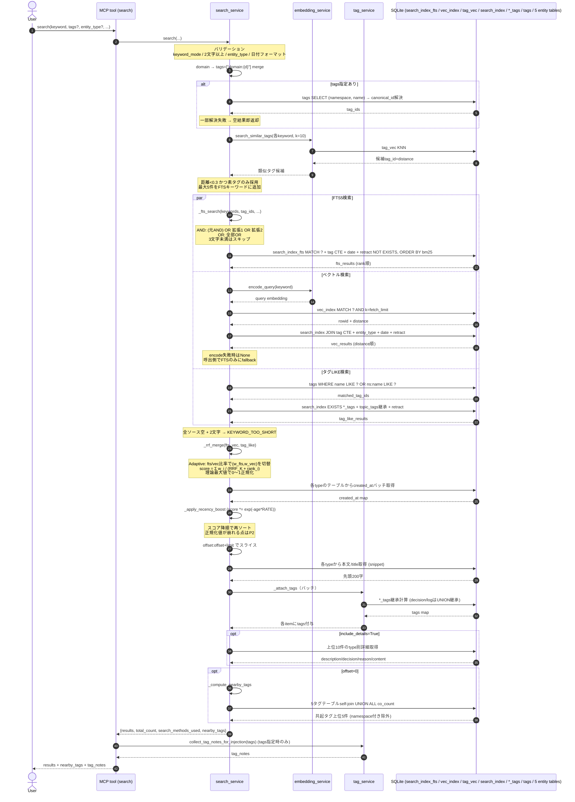

# シーケンス: search v0

## 0. 読み方

本書はcc-memoryのsearchユースケースの動きを写し取ったシーケンス仕様である。実装の凍結を目的とするものではなく、コードが一次情報であり、本書はその時点の実装を読みやすく整理したスナップショットである。差異を見つけたらコードを正とする。

## 1. 概要

searchは、cc-memoryの中で記録済みエンティティ（topic / decision / activity / log / material）を横断検索するユースケースである。FTS5 trigram、ベクトルKNN、タグLIKEの3系統を並列に走らせ、RRF（Reciprocal Rank Fusion）でランク統合し、recency乗算で時間減衰させた結果をページネーションして返す。

- 入口: MCPツール `search(keyword, tags, entity_type, limit, offset, keyword_mode, include_details, domain, date_after, date_before, include_retracted)`（`src/main.py`）
- 呼び出し元: エージェントの調査・コンテキスト取得、各スキル
- 主な責務: ハイブリッド検索、QE（Query Expansion）によるタグ語彙ブリッジ、retract遅延除外、recency boost、snippet/tags/details/nearby_tagsの付与
- 副作用: なし（読み取り専用）

## 2. 主要シーケンス

## 3. ステップ詳細

1-2. ユーザー（エージェント）が `search` ツールを呼び、サービス層に委譲する。
3. バリデーション: `keyword_mode` は `and|or`、各キーワードは2文字以上、`entity_type` は5種のいずれか、`date_after/date_before` はISO形式。日付のみ指定時は `date_before` に `23:59:59` を付加し当日を含める。`domain` 指定時は内部で `tags=["domain:{domain}"]` にマージする（重複除去）。
4-7. tags指定時、`_resolve_tag_ids_readonly` で `(namespace, name)` から `canonical_id` を引いてtag_idリストにする（aliasはcanonical側に解決）。全タグが存在しなければ即 `{"results": [], "total_count": 0, "search_methods_used": []}` を返す。
8-11. **Query Expansion**: 各キーワードで `tag_vec` をKNN（k=10）し、距離<0.3 かつ namespace無し（素タグ）の上位最大5件をFTSキーワード末尾に追加する。元キーワードとは重複除去する。ベクトル検索には元キーワードのみを渡す（拡張しない）。
12-14. **FTS5検索**: AND時は `(元kw1 AND 元kw2) OR 拡張1 OR 拡張2` 形式、OR時は3文字以上のキーワードのみで全OR。tag_ids指定時は `_build_tag_filter_cte` がCTEを組む（decision/logは `topic_tags` ∪ `entity_tags` のUNION + `HAVING COUNT(DISTINCT)` でAND継承）。`RETRACT_FILTER_SQL` で decision/log の `retracted_at IS NULL` を NOT EXISTS する。並びは `bm25(fts, 5.0, 1.0)`。
15-19. **ベクトル検索**: `encode_query(keyword)` で埋め込みを取り、`vec_index MATCH ? AND k=fetch_limit` でKNN。`search_index` にJOINしてtag_ids / entity_type / date / retract を後段フィルタする。OR時は各キーワードで個別検索してマージ（同keyは最小distance採用）。embedding未起動時はNoneを返し、呼出側でFTSのみ進行する。
20-22. **タグLIKE検索**: 全キーワードを `%kw%` パターンにエスケープし、`name LIKE ? OR namespace:name LIKE ?` で `tags` を引いて `matched_tag_ids` を作る（上限100）。`search_index` の各 `*_tags` テーブルに対するEXISTS + topic_tags継承（decision/log）でエンティティを集めて返す。
23. FTS5不可（全キーワード3文字未満）+ ベクトル不可 + tag_like 0件のとき、`KEYWORD_TOO_SHORT` エラーで終了する。
24-26. **RRF統合**: `_compute_adaptive_weights` がFTSヒット数/ベクトルヒット数の比率（0.2 / 0.5 を境界）で `(w_fts, w_vec)` を `(0.5,1.5) / (0.8,1.2) / (1.0,1.0)` に切り替える。各ソースは1始まりランクで `w / (RRF_K + rank)` を加算（RRF_K=60、W_TAG=0.5）。最大スコア `Σ w_i / (RRF_K + 1)` で割って0〜1に正規化する。
27-29. **recency boost**: 各itemの type に応じて `TYPE_TO_TABLE` で正本テーブルから `created_at` をバッチ取得し、`recency_factor = max(exp(-age_days * RATE), FLOOR)` を乗算する。乗算後にスコア降順で再ソートする（注: 正規化済みスコアの解釈は崩れる）。
30. `total_count` を確定後、 `results[offset:offset+limit]` で切り詰める。
31-35. **snippet付与**: typeごとに `SNIPPET_SOURCE` で本文カラムを引き先頭200文字を付ける。material は `"title: content"` 形式。**tags付与**: topic/activity/material は `get_entity_tags_batch`、decision/log は `get_effective_tags_batch_by_ids`（topic_tagsからのUNION継承）。
36-37. `include_details=True` のとき、上位10件にtype別詳細（topic: description+recent_decisions最大3件 / activity: description+status / decision: decision+reason / log: content先頭500字 / material: なし）を付ける。
38-40. **nearby_tags計算**: `offset=0` のときのみ、結果のタグから5タグテーブルでself-joinし、結果に含まれない素タグの共起件数上位5件（namespace付き除外）を返す。
41. ツール層は `tags` 指定があったとき `_maybe_inject_tag_notes` で結果に `tag_notes` を注入する（セッション内初回タグのみ）。

## 4. 入力・出力

### 入力

| 名前 | 型 | デフォルト | 説明 |
|---|---|---|---|
| keyword | str \| list[str] | 必須 | 検索キーワード（各2文字以上） |
| tags | list[str] \| None | None | タグフィルタ（AND結合） |
| entity_type | str \| None | None | topic/decision/activity/log/material |
| limit | int | 10 | 取得上限（1〜50にクランプ） |
| offset | int | 0 | スキップ件数 |
| keyword_mode | "and" \| "or" | "and" | キーワード結合モード |
| include_details | bool | False | 上位10件にdetails自動添付 |
| domain | str \| None | None | 内部で `domain:{d}` タグにマージ |
| date_after / date_before | str \| None | None | YYYY-MM-DD または YYYY-MM-DD HH:MM:SS |
| include_retracted | bool | False | retract済み decision/log を含める |

### 出力（成功時）

| キー | 型 | 説明 |
|---|---|---|
| results | array | 検索結果。各item: `{type, id, title, score, snippet, tags, details?}` |
| total_count | int | recency boost後・slice前の件数 |
| search_methods_used | array | `"fts5" / "vector" / "tag_like"` のうち使われたもの |
| nearby_tags | array | 共起タグ上位5件（`{tag, co_count}`、offset=0時のみ） |
| tag_notes | array | tags指定時、セッション内初回タグのnotes |

### 出力（エラー時）

`{"error": {"code": "INVALID_KEYWORD_MODE" | "KEYWORD_TOO_SHORT" | "INVALID_ENTITY_TYPE" | "INVALID_PARAMETER" | "DATABASE_ERROR", "message": "..."}}`

## 5. エッジケース・例外

- キーワードが2文字未満: `KEYWORD_TOO_SHORT`。
- キーワード3文字未満かつembedding未起動かつtag_like 0件: `KEYWORD_TOO_SHORT`（FTSもベクトルも実質使えない）。
- tagsの一部がDB未登録: ANDフィルタ性質上必ず空結果。即時 `{results: [], total_count: 0, search_methods_used: []}` を返す。
- embedding未起動: `_vector_search` がNoneを返し、`search_methods_used` に `"vector"` が乗らない。FTS+tag_likeのみで進行する。
- AND時にQE拡張あり: 元キーワードはAND結合、拡張タグはOR追加で過剰絞り込みを避ける。
- retract済みdecision/log: `RETRACT_FILTER_SQL` の NOT EXISTS で除外される。`include_retracted=True` で透過する。
- material/topic/activityには `retracted_at` カラムが無いため、retract透過対称化はP12の課題。
- AND時のtag_like意味論: 「**1つのタグ名**に全キーワードが含まれる」という独自セマンティクス（FTS/ベクトルとずれる）。
- OR時のFTS: 3文字未満のキーワードはFTS5クエリから落とす。
- tag_like 100件上限: SQLiteパラメータ上限（999）回避のため `matched_tag_ids` を100件で切る。
- nearby_tags: offset>0 のページでは返さない（先頭ページのみの探索アシスト）。
- vec KNNがk件しか取らない: retract済みエントリがスロットを食うため実効recall劣化が起きる（P3）。

## 6. 関連

- 関連tool: `search_tags`, `get_by_ids`, `get_material`, `get_timeline`, `get_map`, `get_decisions`, `get_logs`
- 主要service: `search_service`, `embedding_service`, `tag_service`
- スキル: `check-in`（呼び出し側）、`recompose-context`
- DB: `search_index`, `search_index_fts`, `vec_index`, `tag_vec`, `tags`, `topic_tags / activity_tags / decision_tags / log_tags / material_tags`, 5エンティティ正本テーブル

## 7. 既知の課題

5次元統合レポートT2（Read Path分析）で次の課題が指摘されている。

- **検索ロジック分岐の5層化と SQL組立コードのコピペ**（P1）。`_fts_search / _vector_search / _tag_like_search` がそれぞれ「tag CTE有無 × keyword_mode × date範囲 × retracted × QE original_kw_count」の多重分岐を内包し、`_vector_search` は AND/OR × tag_ids 有無で計4本のSQLを f-string でインライン生成している。Pr1で SearchPipeline 化を提案している。
- **スコア解釈経路が「正規化→recency乗算」で崩れる**（P2）。`_rrf_merge` が理論最大値で0〜1に正規化した直後、`_apply_recency_boost` が `item["score"] *= recency_factor` で乗算するため「RRF理論最大値に対する比」という解釈が失われる。Pr2で `relevance_score / final_score / score_breakdown` 分離を提案している。
- **retract後のsearch_index/vec_index物理クリーンアップ無しでKNN実効recall劣化**（P3）。`vec_index` のk件スロットを「将来除外される候補」が消費する。Pr3で物理削除＋トップレベルWHERE一発除外を提案している。
- **FTS下限**: `keyword_mode="and"` で1つでも2文字キーワードが混ざるとFTSは丸ごとスキップされる（min_len<3）。エージェントが「2文字＋3文字」のmixed入力を出すとFTS恩恵が消える。
- **snippetがFTSのマッチ位置ではなく単純な先頭200字**（P11）。FTS5 `snippet()` 関数未使用のため、「なぜ上位か」がスニペットから読めず、特にQE拡張で増えた候補で誤マッチを判別しづらい。Pr13で `snippet(...)` 置換を提案している。
- **検索効果測定の仕組みが皆無**（P6）。`QE_DISTANCE_THRESHOLD=0.3` / `W_VEC=1.0` / `RECENCY_DECAY_RATE` などのパラメータを実データで再評価する経路がなく、調整が「感覚」になっている。Pr7で `search_telemetry` テーブル導入を提案している。
- **QE が「素タグ前提」**（P13）。`QE_EXCLUDE_NAMESPACES=True` のため `domain:*` / `intent:*` は除外され、素タグの少ないドメインでは QE がほぼ無効化される。
- **tag_like AND の意味論が不揃い**（P14）。「全キーワードを1つのタグ名が含む」セマンティクスはFTS/ベクトルのAND（複数語が文書内で共起）とずれる。Pr14で「タグ集合のAND」セマンティクスへの変更を提案している。
- **3呼びラウンドトリップ**（P4）：〔解消済〕`get_by_ids` の material レスポンスに `content` / `source` を同梱したため、`search → get_by_ids` の2呼びで material 全文取得が完結する。`get_material` は material_id 単発取得用として残存。

未確認: `embedding_service.encode_query` / `search_similar_tags` の内部実装（モデル呼び出し経路）は今回のスコープ外で深く読んでいない。本書では「テキストからembeddingを取る」「tag_vecをKNNする」抽象レベルにとどめている。
