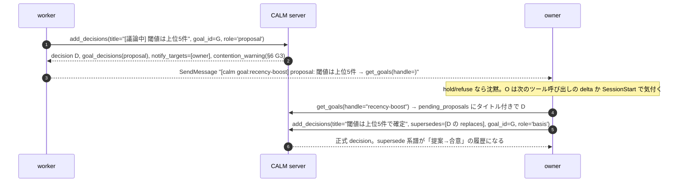

# CALM 協調層設計書 v0 ドラフト

複数セッションの「共同意識」を支える協調層（物理オーケストレーション / セッション間通信ポリシー / goal）の設計ドラフト。docs/spec-v0.md §5 の後継として、凍結を目的とせず議論ベースで改訂する。

**成立経緯**: リポジトリの精読（識別子・ask store・activity・受動通知・ハーネス・撤去された relay v1/v2 の考古学・プロトコル層セマンティクス）を土台に、5つの視点（ネイティブ最大活用 / プロトコル層 / 故障モード / 人間の体験 / 理論・先行事例）で独立に設計案を作り、3つの観点（既存思想の守護 / 分散システムの実務 / 日常運用の体験）で審査して1本に統合し、4レンズ（事実 / 地雷 / 実現性 / 整合性）の反証レビュー30件を反映した版である。統合時に決めた分岐は各節に根拠を書き、ユーザー裁定が要る分岐は §9 に落とした。CALM 本体 DB の過去 decision は作成時に参照できていない（★印が突き合わせ対象）。Claude Code ネイティブ機能の前提は付録A にまとめた。
---

## 0. 読み方・位置づけ

本稿は docs/spec-v0.md §5「協調層」の後継である。凍結を目的とせず議論ベースで改訂する。各節は spec（こう動く・こう作る）/ playbook（こう使う）/ アンカー（どこを見れば検証できるか。コードは file 名、既存決定は名前、既存資料は文書名。CALM 内部 ID は出さない）の3部で書く。確定した事実は断定形（〜である）、推測は「〜と考えられる」で書き分ける（docs/spec/go-gate.md の流儀）。未検証のまま前提として使っている箇所には「(未検証、§9-N 参照)」と明記する。

spec-v0 §5 の3接点（記録ガード / orch-managed / 文脈分断）は relay v2 と orch/worker 体系の撤去（PR #692/#697、migration 0057）で実装の裏付けを失っている。記録ガードは §6（API ガード）に、通信ポリシー一般は §5 に本稿で本格的に引き継ぐ。orch-managed は本稿では未解決のままで、§8 PR-F が置換案（deprecated 宣言）を一行だけ持ち、DROP を含む最終決定は §9-7 の裁定を経た別 decision に委ねる、という断片的な扱いにとどまる。「ネイティブ」とは Claude Code CLI の ListAgents / SendMessage / Monitor / ScheduleWakeup / Agent / Agent teams / `claude -p|--bg` / cloud create_session を指す。CALM 本体 DB の過去 decision は本稿の作成時に参照できていない。突き合わせが要る箇所は §9 に★で列挙する。

**アンカー**: コードベース: docs/spec-v0.md §0/§5、docs/architecture/components.md §5、docs/spec/go-gate.md。既存資料: 付録A。

---

## 1. 問題の分解

### 1.1 spec: 3問題と相互依存

| 問題 | 内容 | 現状の欠落 | 担い手 |
|---|---|---|---|
| P1 物理オーケストレーション | 起動・自己登録・生存・終了・死活検知・回収 | SessionManager は in-memory で tool から不可視、`on_session_removed` 未配線、生存判定3系統・ID 4系統に分裂 | 起動・終了・起床はネイティブ、台帳は CALM（§4） |
| P2 通信ポリシー | 何を・いつ・誰に・どの経路で伝えるか、届かないときどうするか | relay 撤去後は文面規律のみ。delta は揮発 watermark、asks は人間宛限定 | ポリシー・真実源は CALM、配達はネイティブ（§5） |
| P3 goal | 協調の対象と終了条件 | 未実装。intent 完了条件は tag notes の文面のみ。activity.status に遷移規則なし | CALM エンティティ（§3） |

相互依存: P2 の宛先解決（SendMessage の `to` は ListAgents の名前）は P1 の台帳が bridge UUID→CLI 名を持って初めて CALM 側から引ける。P3 の owner / assignee は P1 の台帳行を参照する。P1 の「終了してよいか」は P3 に依存する。意味論は P3 を先に固めるが、台帳は goal 無しでも価値がある（別セッション一覧の一本化）ため PR は P1 を先頭にする（§8）。

### 1.2 spec: 設計の前提となる事実

協調層の真実源は activities.last_heartbeat_*（Stop hook、20分窓）、session_aliases.json（check_in、pid 生存）、SessionManager（launcher heartbeat 60秒 / TTL 300秒、in-memory）の3系統に分裂している。depends_on と ask_blocks は表示メタデータで機械的には何も止めない。delta の watermark は fastmcp ctx.session_id（ephemeral）キーの in-memory dict で、サーバー再起動・再接続・256 セッション超過で黙って消える。ローカル launcher は /session/register 失敗で `sys.exit(1)` する。hooks/preblock_hook.py は SendMessage / ListAgents を allowlist に含まず、`[MDLAT]#NNN` と `log/decision/activity/material/topic #NNN` を deny する（goal / ask はパターン外）。現行ビルドの Monitor に `persistent` 引数は無い（timeout 上限 30 分）。ScheduleWakeup / Routine(send_later) / crossSessionInbound の実引数・既定値・スコープは本稿の作成時点では実機確認できておらず、調査報告由来の記述にとどまる（§9-20）。

**アンカー**: コードベース: src/infra/session_manager.py、src/middleware/delta_middleware.py、src/launcher.py、hooks/preblock_hook.py、src/services/internal_id_patterns.py。既存資料: 付録A、docs/spec-v0.md §6 T-E。

---

## 2. 設計原則（relay v1/v2 の教訓の昇格）

### 2.1 spec: 原則と「踏まない地雷」

| ID | 原則 | 踏まない地雷（relay v2 の実害。撤去直前のコミット 813ff08 の src/services/relay/ と PR #692/#697 から復元） |
|---|---|---|
| A | **真実源は一つ**: 伝達内容は CALM エンティティ（log/material/decision/ask/goal）と台帳・カーソルにのみある。inbox/outbox 本文も goal_events の本文も持たない | relay 本文は CALM に自動反映されず「受信側が add_logs で保存する」文面規律のみだった（T-E 二系統真実源）。inbox の precreate で孤児ファイルが蓄積した |
| B | **push はヒント、pull が正**: SendMessage / delta / hook 注入は「どれを読め」のポインタ。受信側は必ず get_* で取り直す | ask notify_path の原則の一般化。SendMessage は hold/refuse/Remote 宛で沈黙する at-most-once であり、届いた前提の設計は取りこぼす |
| C | **書き込みは冪等**: 台帳は `ON CONFLICT DO UPDATE`、遷移は `UPDATE ... WHERE status='open' AND version=?` の1段、消費はカーソル前進 | relay の at-least-once は重複・自己受信の冪等処理を文面で求めていた。ask_service の TOCTOU 回避を goal にも適用する |
| D | **reconcile で追いつく**: どの経路が落ちても check_in / get_goals / SessionStart / get_overview でカーソル以降を再取得できる | delta の watermark 消失は「消えたこと自体も通知されない」。カーソルを DB に永続化する |
| E | **自前 transport・常駐 thread を持たない** | relay v2 は intake / lease_loop / dispatcher の3 thread + teardown のスナップショット比較 + 孤児 sweep 2種を要し、relay サーバーの運用（招待 URL、revoke 不能、port cutover）も重かった |
| F | **識別子は bridge UUID を正、hook は Claude Code の session_id を正**。対応は register / check_in 時にサーバーが台帳へ書く。祖先 pid 探索はしない | 祖先 pid 2ホップ交差（ps spawn、`_CLI_HOP_WINDOW=2`）は「wrapper を足したら要見直し」と自ら注記する脆さで、撤去後は死にコードになった |
| G | **役割は関係**: owner/assignee は goal_participants の行。env や sessions の静的属性で持たない | migration 0057 は「共有 HTTP デーモンでは per-session env が効かない」を理由に role gating を撤去した。launcher env に載せるのは要求 ID だけにする（§4.3） |
| H | **サーバーは達成を判定しない**: 条件文は自然言語、判定と根拠は構造化して併記。機械的に扱うのは二重判定・根拠ゼロ・終端不変だけ | direction / staleness / destabilization の既存思想。証拠必須は Agent Teams の TaskCompleted hook（exit 2）と同型で内容は検証しない |
| I | **規律は文面でなく API** | spec-v0 §5 の記録ガードは relay 前提の文面で、読み飛ばすと素通りした（T-A）。IMPLEMENT_WORKFLOW_GUARD が成功例 |
| J | **注入は件数1行、行動は人間が呼ぶ skill に置く**: 新セクション 400 字、RULES 追記 150 字以内、UserPromptSubmit に毎ターン注入を足さない | SessionStart 一回きりの Monitor 起動指示は読み流され、毎ターン nudge → PostToolUse(Monitor) マーカー → `persistent:true` 必須（既定は5分でサイレント終了）と三重補強になり、RULES は 1,967 字で安全予算超過の xfail になった。fail-open の多段沈黙は 279 行の wizard skill を要した |
| K | **設定ゼロで縮退動作**: DB だけで成立し、SendMessage / hook は加速装置 | relay は env（既定 OFF）・credential・identity・サーバー稼働の全段が黙って何もしなかった |
| L | **わからないセッションは殺さない・奪わない** | restart_service の「判定不能時の向き」。pending_spawn 無期限残留は expires_at と可視化で扱う |
| M | **終端は不変、改訂は新オブジェクト** | A2A/MCP task と decision の supersede 系譜に合わせる。activity.status は「開く」方向の自動遷移が3系統ありフロー層ローカルなので goal をそこに置かない |

### 2.2 spec: 故障モード（以降 F# で参照）

F1 突然死（kill / compact / resume）→§4.4。F2 launcher 世代交代・resume の identity 断絶→§4.2。F3 watermark / greeted 消失→§5.3。F4 SendMessage 未着 / hold / 100通→§5.3-5.4。F5 Monitor 未起動・期限 kill→§5.3（依存しない）。F6 二重 check_in→§6。F7 誤判定・二重判定→§3.3。F8 headless 暴走→§4.4。F9 読み流し・予算超過→§6.2。F10 remote / Codex 縮退→§7。F11 別マシン→§5.4。F12 閉じた goal への check_in 許可→§3.4（headless 暴走 F8 とは別の故障モード）。

### 2.3 playbook: 採らない概念

CALM の MCP tool としての spawn / kill（サーバーは nohup デーモンで TTY・cwd・permission mode・plugin を継承できず、restart_service の launcher 起動が stdin 継承で不安定な事実が実例）、asks の AI↔AI 一般化（§5.1）、Monitor `persistent:true` 前提の待ち受けと PostToolUse(Monitor) マーカー hook の復活、goal_events の本文列と question/answer 種別、8状態の goal（proposed / paused / awaiting_verdict）、Contract Net の入札、中央スケジューラ、BDI maintain goal、Erlang link、Agent Teams 依存。

**アンカー**: コードベース: src/services/ask_notify.py、src/services/ask_service.py、src/services/activity_service.py、src/services/restart_service.py。既存決定: 「peer 通信はネイティブへ移行」（PR #692 本文）、migration 0057 コメント。既存資料: docs/ops/relay-server.md（relay v2 運用の重さの記録）、docs/spec-v0.md §6。

---

## 3. goal エンティティ

### 3.1 spec: 意味論と配置

goal は「複数セッション（と人間）が協調して到達したい終了状態」を、自然言語の到達条件（criteria）と構造化された判定記録（goal_verdicts）の二層で持つ協調層オブジェクトである。activity が「SV で言える作業単位」なら、goal は「複数 activity の合成が満たすべき状態」である。activity の全完了は goal 達成の必要条件でも十分条件でもない。単一 activity で済むものには goal を作らない。

配置は **asks（migration 0062）と同型の「プロトコル5型の外側にある状態機械付きテーブル群」** とする。relations / pins / citations の CHECK、relations_view、search_index トリガー、export `_JUNCTION`、TYPE_CODE は段階1では無変更である。

| 観点 | A 独立テーブル群（採用） | B activity 属性 | C decision タグ型 |
|---|---|---|---|
| 状態機械 | CHECK + WHERE status で守れる（asks 前例）。goal_verdicts は verdict×kind のクロスカラム CHECK まで含め asks 同格の強度を持たせる（§3.2） | check_in が completed を無条件に in_progress へ戻す自動遷移と衝突 | decision に status が無い |
| 判定履歴・改訂・揺らぎ | goal_verdicts + supersedes_goal_id + goal_destabilizations（0063 と状態遷移の構造は同型。値集合は goals.status の語彙に合わせて調整、§3.2 注記） | activities に retracted_at も supersede も無い | decision_supersedes を流用できる（最強） |
| 検索・pin・export | 段階1は対象外（asks と同じ） | 全部効く | 全部効くが pull_precedents / staleness に判例除外分岐が散在（T-D） |
| 凍結 | 5型集合に触れなければ凍結対象外の前例（0062、0063） | 列追加＝凍結対象外 | 「decision＝合意」の意味を未来の条件へ広げる暗黙変更 |

段階2（5型昇格、別 decision）で要る変更の全列挙: relations CHECK に 'goal'（0046 方式の再作成）、pins CHECK（0034 方式）、citations CHECK + TYPE_CODE 'G'、trg_search_goals_*、SEARCHABLE_TYPES / TYPE_TO_TABLE、export `_JUNCTION` / `_SIZE_FIELDS` + import_provenance CHECK + content_hash 対象（status は除外を踏襲）、relations_view に goal_activities / supersedes / destabilizations 行、readable_id / MessageDisplay、preblock の fullword に 'goal'。これが §9-1 の裁定材料である。長期記憶への橋渡しは decision 経由（charter_decision_id、closing_decision_id。asks.promoted_decision_id と同型）。

### 3.2 spec: スキーマ（migration 0076_add_goals.sql 案）

```sql
CREATE TABLE goals (
  id INTEGER PRIMARY KEY AUTOINCREMENT,
  handle TEXT NOT NULL UNIQUE,          -- 人間可読スラッグ（domain-slug）。SendMessage 本文に載せる名前
  title TEXT NOT NULL,
  criteria TEXT NOT NULL,               -- 到達条件（自然言語）。判定はサーバーがしない
  scope_note TEXT,
  status TEXT NOT NULL DEFAULT 'open'
    CHECK (status IN ('open','achieved','failed','abandoned','superseded')),
  version INTEGER NOT NULL DEFAULT 1,   -- 楽観ロック（F7）
  close_policy TEXT NOT NULL DEFAULT 'owner' CHECK (close_policy IN ('owner','human')),
  write_policy TEXT NOT NULL DEFAULT 'open' CHECK (write_policy IN ('open','owner_only')),
  due_at TIMESTAMP,
  charter_decision_id INTEGER REFERENCES decisions(id) ON DELETE SET NULL,
  supersedes_goal_id INTEGER REFERENCES goals(id) ON DELETE SET NULL,  -- 新 goal が旧を指す（一方向）
  closing_verdict_id INTEGER,           -- goal_verdicts.id（循環 FK を避けアプリ層で検証）
  closing_decision_id INTEGER REFERENCES decisions(id) ON DELETE SET NULL,
  close_reason TEXT,
  created_by_session_id TEXT, closed_by_session_id TEXT,
  created_at TIMESTAMP NOT NULL DEFAULT CURRENT_TIMESTAMP,
  updated_at TIMESTAMP NOT NULL DEFAULT CURRENT_TIMESTAMP,
  closed_at TIMESTAMP,
  CHECK ((status = 'open') = (closed_at IS NULL)),
  CHECK (status NOT IN ('achieved','failed') OR closing_verdict_id IS NOT NULL),
  CHECK (status <> 'abandoned' OR close_reason IS NOT NULL)
);
CREATE INDEX idx_goals_open ON goals(updated_at) WHERE status = 'open';
CREATE TABLE goal_activities (
  goal_id INTEGER NOT NULL REFERENCES goals(id) ON DELETE CASCADE,
  activity_id INTEGER NOT NULL REFERENCES activities(id) ON DELETE CASCADE,
  role TEXT NOT NULL DEFAULT 'serves' CHECK (role IN ('serves','verifies')),
  added_at TIMESTAMP NOT NULL DEFAULT CURRENT_TIMESTAMP, PRIMARY KEY (goal_id, activity_id));
CREATE INDEX idx_goal_activities_activity ON goal_activities(activity_id);
CREATE TABLE goal_decisions (            -- 前提 / 提案 / 成果
  goal_id INTEGER NOT NULL REFERENCES goals(id) ON DELETE CASCADE,
  decision_id INTEGER NOT NULL REFERENCES decisions(id) ON DELETE CASCADE,
  role TEXT NOT NULL CHECK (role IN ('basis','proposal','outcome')),
  added_at TIMESTAMP NOT NULL DEFAULT CURRENT_TIMESTAMP, PRIMARY KEY (goal_id, decision_id, role));
CREATE TABLE goal_participants (         -- 役割 = goal に対する関係（原則G）
  goal_id INTEGER NOT NULL REFERENCES goals(id) ON DELETE CASCADE,
  session_id TEXT NOT NULL,              -- sessions.session_id（FK 無し: ended / remote を許容）
  role TEXT NOT NULL CHECK (role IN ('owner','assignee','reviewer','observer')),
  joined_at TIMESTAMP NOT NULL DEFAULT CURRENT_TIMESTAMP, left_at TIMESTAMP,
  end_reason TEXT CHECK (end_reason IS NULL OR end_reason IN ('released','session_ended','handed_off','goal_closed')),
  PRIMARY KEY (goal_id, session_id, role, joined_at));
CREATE UNIQUE INDEX idx_goal_owner_live ON goal_participants(goal_id) WHERE role='owner' AND left_at IS NULL;
CREATE TABLE goal_verdicts (             -- 追記専用。判定の全履歴（F7）
  id INTEGER PRIMARY KEY AUTOINCREMENT,
  goal_id INTEGER NOT NULL REFERENCES goals(id) ON DELETE CASCADE,
  verdict TEXT NOT NULL CHECK (verdict IN ('achieved','not_yet','failed')),
  kind TEXT NOT NULL CHECK (kind IN ('assessment','close')),   -- close = 終端遷移を伴った行
  evidence TEXT NOT NULL,
  evidence_refs TEXT NOT NULL DEFAULT '[]',  -- JSON [{"type":"material|decision|log|activity|ask|url",...}] 1件以上をアプリ層で要求
  judged_by TEXT NOT NULL CHECK (judged_by IN ('session','human')),
  session_id TEXT, ask_id INTEGER REFERENCES asks(id) ON DELETE SET NULL,
  goal_version INTEGER NOT NULL,
  created_at TIMESTAMP NOT NULL DEFAULT CURRENT_TIMESTAMP,
  -- verdict と kind の組み合わせを DB で強制する（asks の状態機械と同格の保護。§3.1 の主張を実際に満たす）
  CHECK (verdict <> 'not_yet' OR kind = 'assessment'),
  CHECK (kind <> 'close' OR verdict IN ('achieved','failed')));
CREATE INDEX idx_goal_verdicts_goal ON goal_verdicts(goal_id, created_at);
CREATE TABLE goal_destabilizations (     -- 0063 と状態遷移の構造は同型（複数 source、3値解消、エッジ温存）
  goal_id INTEGER NOT NULL REFERENCES goals(id) ON DELETE CASCADE,
  source_decision_id INTEGER NOT NULL REFERENCES decisions(id) ON DELETE CASCADE,
  resolution TEXT CHECK (resolution IS NULL OR resolution IN ('reaffirmed','revised','abandoned')),
  revised_to_goal_id INTEGER REFERENCES goals(id) ON DELETE SET NULL,
  note TEXT NOT NULL DEFAULT '',
  created_at TIMESTAMP NOT NULL DEFAULT CURRENT_TIMESTAMP, resolved_at TIMESTAMP,
  -- revised は改訂先 goal を必ず伴う（app 層の努力目標ではなく DB で強制する）
  CHECK (resolution <> 'revised' OR revised_to_goal_id IS NOT NULL),
  PRIMARY KEY (goal_id, source_decision_id));
CREATE TABLE goal_events (               -- append-only の変更履歴。本文は持たない（原則A）
  seq INTEGER PRIMARY KEY AUTOINCREMENT,
  goal_id INTEGER NOT NULL REFERENCES goals(id) ON DELETE CASCADE,
  kind TEXT NOT NULL CHECK (kind IN ('created','joined','left','verdict_recorded','closed','superseded',
        'destabilized','destabilization_resolved','owner_lost','spawn_requested','spawn_registered',
        'spawn_expired','spawn_cancelled')),
  ref_type TEXT, ref_id INTEGER, actor_session_id TEXT,
  created_at TIMESTAMP NOT NULL DEFAULT CURRENT_TIMESTAMP);
CREATE INDEX idx_goal_events_goal ON goal_events(goal_id, seq);
CREATE TABLE goal_tags (goal_id INTEGER NOT NULL REFERENCES goals(id) ON DELETE CASCADE,
  tag_id INTEGER NOT NULL REFERENCES tags(id) ON DELETE CASCADE, PRIMARY KEY (goal_id, tag_id));  -- domain: 必須
```

注意: (1) `goal_destabilizations.resolution` の値集合は migrations/0063（reaffirmed/revised/retracted）と揃えず、3値目を `abandoned` にしている。理由は goals.status が既に `abandoned`（取り下げ）を使っており、goal 側の語彙を1つの単語に揃えるためである。「0063 同型」が指すのは3値解消・複数 source・エッジ温存という**状態遷移の構造**であり、値の文字列そのものではない。(2) 検討した代替案の `CHECK (status <> 'superseded' OR supersedes_goal_id IS NULL)` は3段改訂で中間 goal が superseded になれないため置かない。系譜は一方向の列だけで表し後継は逆引きする。(3) goal_events は log/material 追加を含めない（既存 delta の scope 拡張で拾う。§5.3）。update_goal(status='abandoned') による終端遷移は `goal_events(kind='closed')` を書く（goal_verdicts.kind='close' が achieved/failed/close 行の総称であるのと同じく、goal_events.kind='closed' も終端遷移全般の総称として扱う。実際にどの終端かは goals.status を見れば分かるため、kind 側に abandoned を別途追加しない）。closed goal の events は close から 30 日で、goal 書き込み時のスイープ（ask_notify の _sweep_expired と同型、常駐 thread 無し）で削除する。(4) goal は retracted_at を持たない。取り下げは status='abandoned'。(5) goal_vec は非目標。

### 3.3 spec: 状態機械・判定主体・改訂・揺らぎ

```
open ─judge_goal(achieved|failed, kind=close)─▶ achieved | failed
open ─update_goal(status='abandoned', reason)─▶ abandoned（goal_events(closed) を書く。3.2 注意(3)）
open ─add_goal(supersedes_goal_id=旧, supersedes_expected_version)─▶ 旧: superseded（同一 tx で新 goal を作り participants/activities を付け替え）
open ─goal_destabilization(mark)─▶ open のまま goal_destabilizations 行 / (resolve: reaffirmed | revised→新 goal | abandoned)
終端からの遷移は無し（原則M）。
```

**judge_goal の手順**:
1. `evidence` 空または `evidence_refs` 空 → `VALIDATION_ERROR`（根拠ポインタ必須。内容は検証しない）。
2. 呼び出し元の役割を goal_participants（lineage 解決込み、§4.2）で引く。live owner 行の有無を判定する。
3. 次のいずれかに該当すれば `kind='assessment'` 行だけを追記し goal_events(verdict_recorded) を書く。応答 `{recorded:'assessment', goal, hint}`。
   - `verdict='not_yet'`。
   - `close_policy='owner'` かつ live owner 行が存在し、かつ呼び出し元がその live owner でない。
   - `close_policy='human'` かつ `judged_by≠'human'`。
4. 上記のいずれにも該当しなければ close へ進む。close へ進む経路は3通りある: (a) `close_policy='owner'` かつ呼び出し元が live owner、(b) `close_policy='owner'` かつ live owner 行が無い（人間直轄）かつ `judged_by='human'`、(c) `close_policy='human'` かつ `judged_by='human'`（live owner の有無を問わない）。手順3の条件は「close_policy='owner' かつ live owner が存在する場合」だけを assessment 止まりにする設計であり、live owner 不在の人間直轄 goal は (b) の経路で judged_by='human' なら常に close へ進める。
5. close へ進んだ場合、同一 tx で `kind='close'` 行を追記し、`UPDATE goals SET status=?, version=version+1, closed_at=now, closed_by_session_id=?, closing_verdict_id=?, closing_decision_id=? WHERE id=? AND status='open' AND version=?` を1段で実行する。0行なら現在行を読み、status≠open なら `GOAL_ALREADY_CLOSED`、そうでなければ `GOAL_VERSION_CONFLICT` を**現在の goal を同梱した情報応答**として返す（再送しても同じ結果）。
6. `judged_by='human'`: ask_id 指定時は asks.status ∈ ('answered','promoted') かつ ask_blocks が goal の serves/verifies activity を含むことを検証する。ask_id 無しは「人間が同席するセッションで承認を得た」宣言で、add_decisions の合意基準と同じ信頼モデルである。
7. `record_decision`（既定: human なら True、session なら False）: True なら add_decisions で判定 decision を作り goal_decisions(outcome) と closing_decision_id に紐づける。judged_by='session' のときは title に `[セッション判定]` を自動付与し、SessionStart goals 節で「セッション判定で閉じた goal N 件」を人間に後追い表示する。achieved で decision を必須にはしない（人間未承認 decision の量産を避ける）。
8. close 成功時は participants の live 行を `goal_closed` で解除し、goal_events(closed) を書き、応答に `notify_targets`（§5.3）を同梱する。

`add_goal(supersedes_goal_id, supersedes_expected_version)` による旧 goal の superseded 遷移も同型の1段 UPDATE（`WHERE id=<supersedes_goal_id> AND status='open' AND version=<supersedes_expected_version>`）を新 goal 作成と同一トランザクションで実行し、0行なら新 goal 作成ごと中断して `GOAL_ALREADY_CLOSED` または `GOAL_VERSION_CONFLICT` を返す。`supersedes_expected_version` は新 goal 自身ではなく**旧 goal（supersedes_goal_id）に対する期待版番号**であることをツール引数名として明示する（judge_goal の `expected_version`（対象 goal 自身の版番号）と区別するための命名）。

**判定主体**: assessment は participant なら誰でも書ける（assignee の完了主張）。close は live owner、または人間（close_policy='human'、あるいは live owner が無い「人間直轄」goal）。人間直轄 goal は任意のセッションが judged_by='human' で閉じるか、update_goal で owner を引き受けてから閉じる（手順4(b)/(c)）。

**算出状態（保存しない）**: `verdict_due` = open かつ（serves activity が1件以上あり全て completed、または due_at 経過）。この算出は depends_on を参照しない（§3.4「depends_on との関係」）。`shaky` = 未解消の destabilization がある、または charter/basis decision が supersede_service で is_superseded / destabilized。`assessment_stale` = 最新 verdict より後に serves activity / outcome material が更新された。いずれも併記するだけで遷移させない。

### 3.4 spec: activity / decision / ask との関係

- **activity**: role='serves' の activity 群が goal に仕え、'verifies' は検証専用。`update_activity(status='completed')` は**拒否しない**。応答に `goal_hint{goal_id, handle, verdict_due, owner_alive, remaining_serves}` を付け、最後の serves なら「judge_goal（または /goal-check）を」を1行添える。check_in は goal を `goal` ブロック（handle / status / criteria / owner / verdict_due / 自分宛 assessment 件数 / since_events / CHECKIN_CONFLICT）として返し、閉じた goal の activity への check_in は許可して `goal_closed:true` を返す（F12。headless 暴走の F8 とは別の故障モードとして扱う）。check_in の in_progress 自動更新は goal に触れない。
- **decision**: 提案は既存の `[議論中]` プレフィックス decision を `add_decisions(goal_id, role='proposal')` で goal に紐づけて表す（新 prefix は作らない。パラメータ名は goal_decisions.role 列と一致させる。§3.5）。採用は owner が正式 decision で `replaces` supersede する（supersede 系譜が「提案→合意」の履歴になる）。却下は retract。前提は role='basis'、判定は role='outcome'。
- **ask**: asks は人間専用のまま変更せず、kind CHECK にも触れない（0068 の CHECK は `ALTER TABLE ADD COLUMN` で追加されており、変更はテーブル再作成を要する）。close_policy='human' で人間が離席中なら、owner は通常の ask（blocks = 未完の serves/verifies activity、素タグ `goal-close`、context に handle）を起票し、answer 後に judge_goal(judged_by='human', ask_id) で閉じる。serves が全て completed で blocks に指定できないときは role='verifies' の判定 activity を1件作って block する（add_ask は全 blocks が completed だと拒否するため）。
- **depends_on との関係**: 既存の activity_dependencies（depends_on）は表示専用で機械的には何も止めない（check_in は未完了の依存先があっても拒否・警告しない）。goal の verdict_due 算出は depends_on を参照しない。理由は、depends_on は activity 単位の任意の前後関係であり goal の serves 集合と1対1に対応しないため、これを verdict_due 計算へ混ぜると「goal の達成条件」と「activity 同士の順序」という別種の待ち条件が暗黙に合成され、原則H（サーバーは達成を判定しない）が意図する「条件は明示的に書かれたものだけを見る」から外れるおそれがあると考えられるためである。既存の SessionStart blocked_by 行・check_in の dependencies 配列による表示はそのまま活き、goal-check skill（§3.6）が判定時に依存先の状態を人間に見せる形で運用上の可視化を担う。depends_on / ask_blocks / goal を「activity X を止めている条件」の単一概念へ統合する構想は本稿の非目標（§8）とし、扱うなら別 decision とする。

### 3.5 spec: ツール IF（非凍結。新規6本、既存引数追加4本）

```
add_goal(title, criteria, tags, activities=[], scope_note=None, close_policy='owner', write_policy='open', due_at=None,
         owner='self'|'none', charter_decision_id=None, supersedes_goal_id=None, supersedes_expected_version=None)
  -> {goal, handle, spawn_suggestion, notify_targets, warnings}     # domain: タグ必須、criteria 必須
get_goals(ids=None, handle=None, status='open', mine=False, activity_id=None, verdict_due_only=False, limit=20)
  -> {goals:[{goal, activities[{id,title,status,live_by}], participants[{session_id,role,alias,peer_name,alive,reachable}],
       verdicts(最新3+件数), pending_assessments, pending_proposals, shaky, assessment_stale, verdict_due,
       awaiting_human_verdict, progress, spawn_suggestion}],
      since_events(自 cursor 以降 ≤20)}
judge_goal(goal_id, verdict, evidence, evidence_refs, expected_version, judged_by='session', ask_id=None, record_decision=None)
  -> {recorded:'close'|'assessment', verdict_id, goal, decision_id?, notify_targets}
   | {info: GOAL_ALREADY_CLOSED|GOAL_VERSION_CONFLICT, goal} | {error: VALIDATION_ERROR|GOAL_HUMAN_VERDICT_REQUIRED}
update_goal(goal_id, expected_version, title=None, criteria=None, scope_note=None, due_at=None, close_policy=None,
            write_policy=None, status=None, reason=None,
            participants=[{session_id|'self', role, action:'add'|'leave', handoff_to=None}], activities=[{id, action, role}])
  -> {goal, notify_targets} | {info: ...} | {error: GOAL_OWNER_ALIVE}   # status は 'abandoned' のみ（reason 必須）
goal_destabilization(goal_id, decision_id, action='mark'|'resolve', resolution=None, revised_to_goal_id=None, note='')
request_spawn(goal_id, relation='assignee', brief_material_id, launcher_hint, ttl_minutes=30, expected_minutes=60)
  -> {spawn_request, launch_command}                            # §4.3
既存拡張: check_in(activity_id, goal_id=None)  # goal_activities に無ければ serves で追加 + participant(assignee) 自動登録
          add_activity(..., goal_id=None) / add_decisions(..., goal_id=None, role='proposal'|'basis'|'outcome')
          get_overview: 5節目 goals（open / verdict_due / 舵取り不在 / セッション判定 / runaway_candidates / 応答なきspawn要求）
          get_sessions(self=False): 台帳を源泉に。self=True で自分の bridge id
```

`get_goals` の per-goal `spawn_suggestion`（サーバーが算出する「spawn を検討すべき」等の示唆）と `request_spawn` の入力引数 `launcher_hint`（呼び出し元が渡す起動ヒント）は別概念である（名前を似せない）。`launcher_hint` の内容は起動コマンド生成に使う短いメタデータ（許可された CLI フラグの列挙、モデル指定など）に限り、200字以内とする。goal 本文で伝えるべき作業指示は `brief_material_id` の material に書き、`launcher_hint` に自由文の指示は書かない（原則A の徹底）。

呼び出し元識別は全て `get_caller_session_id()`（bridge 優先）。

### 3.6 spec: hook / skill 変更点

- hooks/session_start_hook.py: `Section("goals", priority=42, budget=400)`（§6.2）。自セッション判定は stdin session_id → sessions.cli_session_id の DB 直読み（前提の検証状況は§4.2参照、未検証、§9-11）。hooks/stop_hook.py: checked_in_activity の goal が終端・superseded・destabilized に変わったら nudge `goal_changed` を1 goal 1回だけ events.jsonl に書く（block しない）。hooks/user_prompt_submit_hook.py: `_format_nudge_message` に `goal_changed` を追加（未知 type 温存の後方互換に乗る）。
- 新規 skill: `goal-start`（人間の一文から title / criteria / domain を起こし、**criteria を必ず人間に読み上げて確認**してから add_goal。既存 in_progress activity の紐づけを提案）/ `goal-spawn`（§4.3）/ `goal-check`（criteria を1項目ずつ evidence に当て、達成 / 未達 / 不明の表を人間に見せる。**閉じない**。担当セッション死亡で止まっている activity や依存未完の serves activity（depends_on、§3.4）を列挙し、再 spawn / 引き取り / shelve を聞く）/ `goal-finish`（goal-check の結果を持って judge_goal し、notify_targets へ「閉じた。get_goals(handle) で確認して wrap up（sync-memory→退場）」を1通）。
- 改訂 skill: activity-start 手順7「会話または goals 節に goal があれば goal_id を渡す。無ければ聞かない」/ activity-finish 手順2の後「goal_hint.verdict_due なら /goal-check を一言提案（勝手に閉じない）」/ check-in 手順3の後「goal ブロックの since_events を『別セッションの動き』として1〜3行含める。CHECKIN_CONFLICT は冒頭で伝えて続行するか人間に確認」/ sync-memory Step2「goal 配下の activity は確信度『高』でも goal を閉じない。/goal-check へ委譲」/ decision-record「goal 配下で自分が owner でなければ [議論中] + role='proposal'」/ overview・man に goals 節。criteria の初期テンプレートは intent tag notes の完了条件文面（discuss / design / debug / investigate / thinking）を流用し、implement / review は goal-start が新規に書く（intent:implement / review の tag notes 自体に完了条件行が無い件は §9-17 に残す）。

### 3.7 spec: シーケンス（判定と二重 close の回避）

```mermaid
sequenceDiagram
    autonumber
    participant W as worker (assignee)
    participant S as CALM server
    participant O as owner
    W->>S: update_activity(A3, completed)
    S-->>W: goal_hint{verdict_due:true, owner_alive:true}
    W->>S: judge_goal(G, achieved, evidence, refs=[material], expected_version=3)
    S-->>W: recorded=assessment（非 owner）+ notify_targets=[owner]
    W-->>O: SendMessage "[calm goal:recency-boost] verdict_recorded: 達成主張 → get_goals(handle=)"
    O->>S: get_goals(handle="recency-boost")
    O->>S: judge_goal(G, achieved, evidence, refs, expected_version=3, judged_by='human')
    S->>S: INSERT verdict(kind=close); UPDATE goals ... WHERE status='open' AND version=3 → 1行
    S-->>O: recorded=close, goal(version=4), notify_targets=[W]
    W->>S: judge_goal(G, achieved, ..., expected_version=3)（再送）
    S-->>W: info GOAL_ALREADY_CLOSED + goal
```

### 3.8 playbook: 対話例と表示例

```
人間: /goal-start 検索の recency boost を本番に入れて「最近の決定が上に来る」状態にする
Claude: goal を立てます。達成条件はこれで良いですか?
  1. recency boost が main にマージ済み  2. 直近7日の decision が search 上位3件に入る実測が material にある  3. tag-notes の検索規律が更新済み
人間: 2 は「上位5件」で
Claude: 登録しました（recency-boost、domain:calm、serves 0件、参加1）。別セッションに切りますか? → /goal-spawn
```

SessionStart goals 節（≤400字）は、行ごとに固定書式で積み上げて予算を超える手前で打ち切る（実装上の注意を参照）。ヘッダ行は件数のみの短い形にし、使い方（`check_in(activity, goal_id)` / `get_goals(handle=)`）は毎回繰り返さず RULES 側の一回の説明（§6.2）に委ねる。1 goal 1行は `- <handle>「<title、上限14字、超過は…>」: serves a/b 判定待ち k 期限 MM-DD` の固定テンプレートとする。例:

```
参加中 goal 5（owner 2 / 判定待ち 1 / 舵取り不在 0）
- recency-boost「recency boost 本…」: serves 1/3 判定待ち0 期限09-20
- search-rerank「rerank 精度改善」: serves 2/2 判定待ち1 期限未定
- ask-triage「asks滞留の解消」: serves 0/1 判定待ち0 期限09-25
```

get_overview goals 節: `recency-boost — serves 1/3、稼働中 rb-impl（12m前）・rb-verify（離席 2h、TTL失効）、判定待ち 1、揺らぎ なし、舵取り calm-d8`。

**実装上の注意（injection_compositor）**: `injection_compositor._hard_truncate` は行境界を見ない単純な文字数カット（`text[:budget-len(marker)]`）であり、これをそのまま goals 節に適用すると行の途中で寸断される（見出し行＋3行の実例を素直に組むと 400 字を超えることを確認済み）。goals 節の compose 関数は ask_notify_section.build_ask_notify_lines と同じ「予算内に収まった行だけを積む」実装にし、収まらない goal は「他 N 件」として件数だけ示す。`_hard_truncate` への到達を前提にしない。

**アンカー**: コードベース: migrations/0062_add_asks.sql、migrations/0063_add_decision_supersedes_kind.sql、migrations/0068_add_asks_kind_and_tags.sql、src/services/ask_service.py、src/services/supersede_service.py、src/services/checkin_service.py、skills/decision-record/SKILL.md、migrations/0015・0024・0039、hooks/ask_notify_section.py。既存決定: 「データセマンティクス凍結方針」「3プロトコル決定」（§9-1）。既存資料: docs/spec-v0.md §2.2、docs/precedent-format.md。

---

## 4. セッション台帳と物理オーケストレーション

### 4.1 spec: 台帳 sessions（migration 0075_add_sessions.sql 案。0048 の役割抜き再設計）

```sql
CREATE TABLE sessions (
  session_id TEXT PRIMARY KEY,             -- bridge UUID。無ければ 'eph:'||ctx.session_id
  id_kind TEXT NOT NULL CHECK (id_kind IN ('bridge','ephemeral')),
  harness TEXT, host TEXT, cwd TEXT,       -- launcher の申告（CALM_HARNESS 等）
  cli_session_id TEXT, cli_name TEXT, cli_pid INTEGER,   -- resolve_cli_session で充填（register / check_in 時）
  cli_resolve_status TEXT CHECK (cli_resolve_status IS NULL
    OR cli_resolve_status IN ('resolved','header_missing','file_not_found','stale')),  -- 解決試行の結果（診断用）
  mode TEXT NOT NULL DEFAULT 'interactive' CHECK (mode IN ('interactive','headless')),
  parent_session_id TEXT, spawn_request_id INTEGER, predecessor_session_id TEXT,   -- 系譜（役割ではない）
  expected_end_at TIMESTAMP,               -- headless の想定終了（F8）
  started_at TIMESTAMP NOT NULL DEFAULT CURRENT_TIMESTAMP,
  last_heartbeat_at TIMESTAMP,             -- launcher /session/register（60秒）
  last_tool_call_at TIMESTAMP,             -- 全ツール呼び出しの touch（60秒スロットル）
  last_checkin_activity_id INTEGER, last_checkin_at TIMESTAMP,
  ended_at TIMESTAMP, ended_reason TEXT CHECK (ended_reason IS NULL OR ended_reason IN ('unregister','ttl','superseded')),
  resurrect_count INTEGER NOT NULL DEFAULT 0,
  delta_state_json TEXT,                   -- delta の scope + watermark（§5.3）
  goal_cursor INTEGER NOT NULL DEFAULT 0,  -- goal_events.seq の既読水位
  CHECK ((ended_at IS NULL) = (ended_reason IS NULL))
);
CREATE INDEX idx_sessions_live ON sessions(last_heartbeat_at) WHERE ended_at IS NULL;
CREATE INDEX idx_sessions_cli ON sessions(cli_session_id) WHERE cli_session_id IS NOT NULL;
```

0048 との違い: role / handle / topic_id を持たない（原則G）。1行 = 1 launcher UUID。カーソルを別表にせず台帳の列に置くのは per-session 状態の置き場を1つに保ち部品数を増やさないためである。行は削除しない。`cli_resolve_status` は「なぜ cli_* が NULL のままか」を診断するための列で、ヘッダ不在（header_missing）・登録ファイル/CLI session ファイル不在（file_not_found）・以前は解決していたが再照合で不一致（stale）・成功（resolved）を区別する（現行 check_in の `cli_unresolved` 一本では区別できない状態を段階1から解消する）。

生死の判定（alive を頂点とする包含関係。三値の排他的分類ではない）: **alive** = ended_at IS NULL かつ（last_heartbeat_at が 300 秒以内、または last_tool_call_at が 10 分以内）。**working** は alive の部分集合で、alive かつ last_checkin_activity_id あり かつ activities.last_heartbeat_at（20 分窓）が有効な行を指す。**unknown** は id_kind='ephemeral' の行のうち last_tool_call_at が 10 分を超えたものに限る特別状態で、alive とは独立の軸である。alive でも ephemeral でもない行（heartbeat/tool call がどちらも途絶した bridge 行）は表示上 **dead**（生存不明・生存終了）として扱い、get_sessions では ended_at が立つまでの間は alive=false・unknown=false の行として現れる。unknown 判定に該当する行は表示上 alive 側に倒す（原則L）。「生存 = launcher heartbeat、着手中 = Stop heartbeat」と役割を分ける。

### 4.2 spec: 書き手と経路（全て既存フックポイント、全て冪等）

| # | 経路 | 変更 |
|---|---|---|
| 1 | `POST /session/register`（launcher の 60 秒 heartbeat） | `INSERT ... ON CONFLICT(session_id) DO UPDATE SET last_heartbeat_at=now, ended_at=NULL, ended_reason=NULL, resurrect_count=resurrect_count+(ended_at IS NOT NULL)`。body の任意フィールド `harness / host / cwd / mode / spawn_request_id` を取り込む（未知フィールドは無視: launcher と server の版ズレ耐性。ただしこの縮退が「登録は成功したが中身が薄い」ことを外から見えなくする副作用は `cli_resolve_status` で緩和する）。cli_session_id が NULL の間は `resolve_cli_session(bridge id)` を試み、結果に応じて `cli_resolve_status` を更新する（ローカルでは登録ファイルと ~/.claude/sessions が同一ホストにあり register 時点で解決できると考えられる。失敗は次の heartbeat で再試行し、その間は `header_missing` または `file_not_found` を保持する）。**DB 例外は log のみで登録は成功させる**（ローカル launcher は登録失敗で `sys.exit(1)` する。G9） |
| 2 | `POST /session/unregister` | `mgr.unregister` を呼ぶ**前**に台帳へ `ended_reason='unregister'` を書く |
| 3 | `SessionManager(on_session_removed=mark_ended)` を src/main.py で配線 | 署名 `Callable[[str], None]` は reason を渡さないので、`mark_ended` は「未 ended の行だけ `ended_reason='ttl'`」の冪等更新にする（経路2が先なら何もしない）。SessionManager の署名変更は不要である |
| 4 | `check_in` | 既存 `register_checkin` の結果（cli_session_id / name / pid / cwd）を台帳行にも書き、`last_checkin_activity_id / last_checkin_at` を更新。同じ cli_session_id を持つ `ended_at IS NULL` の別行があれば旧行を `superseded`、新行に `predecessor_session_id` を書く（F2: launcher 世代交代・resume で bridge UUID が変わっても CLI session が同じなら系譜が繋がる。ただし CLI session id が resume 前後で保たれることは未検証の仮定である。§9-11）。goal_participants / ask_requesters の所有判定は `session_lineage(session_id)`（predecessor を辿る再帰 CTE）で解決する |
| 5 | `SessionTouchMiddleware`（Delta の後ろ） | `get_caller_session_id()` をキーに `last_tool_call_at` を 60 秒に1回だけ UPDATE（in-memory スロットル）。bridge 無しの呼び出し元は `id_kind='ephemeral'` で行が立つ（remote / Codex の最低保証、F10） |

session_aliases.json は段階1では**台帳からの投影**に降格する（check_in 後に書き出し、hook が MCP 往復なしに読む用途は残す）。hook の自己識別は stdin session_id で `sessions.cli_session_id` を DB 直読み（hooks/heartbeat.py と同じ隔離パターン）する。この自己識別は「hook stdin session_id と ~/.claude/sessions/<pid>.json の sessionId が同一値である」という未検証の仮定に立っており（§9-11）、崩れた場合は Stop hook の `goal_changed` nudge が誤って自セッションを除外・混入しうる。resolve_identity_by_ancestry は配線せず削除候補とする。

### 4.3 spec: 起動（登録ベース）と spawn_requests（migration 0077 案）

起動主体は人間の対話セッション / owner セッション（Bash で `claude -p --max-turns N -n <name>` または `claude --bg -n <name>`）、Agent tool、Agent teams、cloud create_session である。CALM が保証するのは起動経路ごとに異なる。**ローカル起動**（`claude -p` / `claude --bg` / Agent tool / Agent teams。いずれも launcher 経由）は経路1・4・5（register / check_in / SessionTouchMiddleware）で台帳に載る。**cloud create_session（remote 経由）は経路1が使えない**: src/remote.py は main.py の `__main__` 起動パス（SessionManager 生成・lock・watchdog）を通らないため `_session_manager` が None のままで `/session/register` は503を返す。cloud セッションは経路4・5（check_in・SessionTouchMiddleware）のみで、id_kind='ephemeral' の行として台帳に載る（§4.1、§7）。

```sql
CREATE TABLE spawn_requests (
  id INTEGER PRIMARY KEY AUTOINCREMENT,
  goal_id INTEGER NOT NULL REFERENCES goals(id) ON DELETE CASCADE,
  relation TEXT NOT NULL DEFAULT 'assignee' CHECK (relation IN ('assignee','reviewer','observer')),
  brief_material_id INTEGER REFERENCES materials(id) ON DELETE SET NULL,   -- 起動時に読ませる指示は material（黒板）
  requested_by_session_id TEXT, launcher_hint TEXT,       -- launcher_hint の内容制約は §3.5 参照
  status TEXT NOT NULL DEFAULT 'requested' CHECK (status IN ('requested','registered','expired','cancelled','ended')),
  expires_at TIMESTAMP NOT NULL, expected_minutes INTEGER, launched_session_id TEXT,
  created_at TIMESTAMP NOT NULL DEFAULT CURRENT_TIMESTAMP);
```

`goal-spawn` skill の型: (1) `request_spawn` を起票（brief は material）。(2) 応答の `launch_command`（例: `CALM_SPAWN_REQUEST_ID=7 CALM_SESSION_MODE=headless claude -p --max-turns 60 -n rb-verify "<固定文: get_goals(handle='recency-boost') と brief を読んでから check_in(activity, goal_id)。終わったら judge_goal → sync-memory>"`）を人間に見せ、「やって」なら Bash で実行する。headless は `--max-turns` 必須（F8）、owner と同じ `--permission-mode` で起動する（§5.4）。(3) 子の launcher は env `CALM_SPAWN_REQUEST_ID` / `CALM_SESSION_MODE` を register body に載せる。env はセッションごとの launcher プロセスに効く（0057 が否定したのは共有 HTTP デーモン側の env）。**役割は env に載せない**。載るのは要求 ID だけで、関係は server が `spawn_requests.relation → goal_participants` に書く。(4) server は register 時に spawn_requests を `registered` にし、`launched_session_id`、sessions.parent_session_id（= requested_by）、expected_end_at（= now + expected_minutes）を書き goal_events(spawn_registered) を積む。(5) `expires_at` 超過で `requested` のままの行は既存 SessionManager reaper の周期（30 秒）に相乗りして `expired` にし、goal_events(spawn_expired) を積む（常駐 thread を増やさない。pending_spawn 無期限残留の再発防止）。この走査は reaper の stale 判定ループの**後段**（unregister と同じ経路、`_lock` の外）に置き、DB 例外は SessionManager 自体を落とさずログのみで継続する（reaper は本来 DB 非依存の in-memory ループであり、DB 依存を持ち込む箇所を限定するため）。(6) goal が close/supersede されたとき、その goal に紐づく `requested` 状態の spawn_requests 行は同一トランザクションで `cancelled` にし goal_events(spawn_cancelled) を積む。同一 goal×relation に複数の requested を許す（並列 worker 起動が主目的であるため、「同一 goal×relation は1件」制限は採らない）。

expired / cancelled のまま誰も気づかない状態を避けるため、get_overview の goals 節に「応答なきspawn要求」（直近7日の expired 件数の集計）を1項目追加する（§3.5）。これにより「spawn を頼んだのに誰も来ず、かつ誰にも気づかれない」という旧 pending_spawn の実害を、expires_at による失効に加えて可視化の面でも塞ぐ。

request_spawn を経ない起動（人間が直接 `claude --bg`、Agent teams）も正当で、check_in(goal_id) で participant になる。Agent tool（subagent）は親の launcher / bridge UUID を共有するため台帳に行は増えず、participant は親名義になる。Agent teams の teammate が独立 launcher を持つかは未検証で、持つなら別行になると考えられる（§9-11、§9-23）。

### 4.4 spec: 生存・終了・死活・回収（F1 / F2 / F8 / F12）

終了3経路 + TTL: (1) **自然終了**: headless は max-turns / ResultMessage で終わり、launcher の stdin EOF → unregister → ended（最速・最確実）。(2) **goal 終端の Stop hook nudge**: checked_in_activity の goal が終端なら nudge `goal_changed` を1回積む。headless（mode='headless'）向け文面は「goal は閉じた。add_logs で退場ログを書き sync-memory して終了せよ」。block はしない。(3) **SendMessage による wrap-up 要請**: owner が close 後に notify_targets へ1通送る。受信側は get_goals で goal_closed を確認して退場する。強制ではない。

- **突然死（F1）**: TTL 300 秒で ended（'ttl'）。goal_participants の解除は **ended から 120 秒の猶予後**に reaper が行う（瞬断の再登録は経路1の upsert で resurrect され、猶予内なら participant は残る。relay teardown のスナップショット比較の代替）。owner が解除された open goal は「人間直轄」に自動で戻り goal_events(owner_lost) を積み、get_overview goals 節に「舵取り不在」を出す。自動再割当はしない（原則L）。compact: HookState は clear されるが台帳は DB なので影響なし。`_COMPACT_PRESERVE` に `checked_in_activity` を追加して compact 後の heartbeat 空白を無くす。resume: 新 launcher → 新 bridge UUID → 経路4で系譜接続（「resume で CLI session id が保たれる」は未検証の仮定である。§9-11）。
- **headless 暴走（F8）**: サーバーは kill しない。mode='headless' かつ alive かつ expected_end_at 超過かつ 30 分以上その actor の goal_events / logs が無いセッションを get_overview `runaway_candidates` に cli_pid / cli_name 付きで出す。
- **同時起動数（G8 SESSION_SPAWN_LIMIT）**: 同一 parent の生存子が 8 を超えたら登録は通しつつ warning を log と get_overview に出す（CLAUDE.md 手順7の同時再接続失敗と直結する上限。§9-18）。
- **get_sessions**: 源泉を台帳に変更（alive/working/unknown、alias、cli_name、cwd、host、mode、parent、last_checkin_activity、cli_resolve_status）。ListAgents の自動生成名との突き合わせ用途は維持する。

### 4.5 spec: シーケンス（起動→自己登録→退場）

```mermaid
sequenceDiagram
    autonumber
    actor H as 人間
    participant O as owner セッション
    participant S as CALM server
    participant L as 子 launcher
    participant W as 子セッション (claude -p)
    H->>O: /goal-spawn
    O->>S: request_spawn(G, assignee, brief_material, ttl=30m)
    S-->>O: spawn_request(id=7), launch_command
    O->>W: Bash `CALM_SPAWN_REQUEST_ID=7 claude -p --max-turns 60 -n rb-verify "..."`
    L->>S: POST /session/register {session_id:U, spawn_request_id:7, mode:headless}
    S->>S: sessions upsert(U, parent=O); spawn_requests(7)=registered; goal_participants(G,U,assignee)
    W->>S: get_goals(handle=...) → brief を読む → check_in(A, goal_id=G)
    S->>S: sessions.cli_* / last_checkin 充填; delta baseline を delta_state_json に保存
    W->>S: 作業 ... add_material / add_logs / judge_goal(assessment)
    W-->>W: ResultMessage で終了 → L: stdin EOF
    L->>S: POST /session/unregister {U}
    S->>S: ended_reason=unregister → on_session_removed → 120 秒後 participants.left_at, spawn_requests(7)=ended
```

**アンカー**: コードベース: src/infra/session_manager.py、src/main.py（/session/register・/session/unregister、SessionManager() 生成箇所）、src/launcher.py（_register_session、sys.exit 経路、heartbeat_loop）、src/infra/session_identity.py、src/services/session_registry_service.py、hooks/hook_state.py、hooks/heartbeat.py、migrations/0048・0057。既存決定: 0057 コメント「登録経路不在・共有デーモンの env」。既存資料: 付録A、CLAUDE.md 手順7。

---

## 5. セッション間通信ポリシー

### 5.1 spec: メッセージ型 → CALM エンティティ + ネイティブ配達 + pull + 冪等性

R0〜R3 は §5.3 の通知経路の確実性段階を指す。

| 型 | 真実源（書く先） | push（ヒント） | pull（正） | 冪等性 |
|---|---|---|---|---|
| M1 事実・経緯・成果 | add_logs / add_material（serves activity に紐づけ） | 送らないのが既定（R3 は使わない） | delta（goal scope、cursor 永続、R2）、check_in（R0） | entity id |
| M2 提案（worker→owner） | `[議論中]` decision + goal_decisions(proposal) | SendMessage 1 通（R3） | delta（R2）、get_goals.pending_proposals（R0） | decision id |
| M3 割当・依頼 | goal_participants(assignee) + spawn_requests / activity | 起動、または生存中なら SendMessage（R3） | SessionStart goals 1行（R1）、get_goals(mine)（R0） | (goal, session, role) |
| M4 判定報告 | goal_verdicts | SendMessage 1 通（R3） | get_goals.verdicts（R0）、check_in goal ブロック（R0）、cursor（R2） | verdict id / version |
| M5 goal 状態変化 | goals.status / goal_events | 閉じた側が notify_targets へ（R3） | Stop nudge `goal_changed`（R1）、SessionStart（R1）、get_overview（R0） | goal version |
| M6 制御（wrap up） | 記録しない（結果は sessions.ended_reason） | SendMessage 平文 | 無し | 不要 |
| M7 人間への判断委譲 | asks（既存・人間専用・不変） | notify_path + hook 二重網 | get_asks（R0） | fingerprint |
| M8 生存・所在 | sessions | 無し | get_sessions（R0）、participants（R0） | UUID 上書き |

**asks を人間専用に保つ裁定**: 設計案の審査でも asks の audience 一般化は採らないという結論で揃った。理由: RULES「ask は離席中・セッション跨ぎ限定」「発効は人間のメタ ask 裁定のみ」、ask-answer skill「AI は作文しない」、ask-watch の poll.sh（生 sqlite で open を数え audience を見ない）が全て人間宛前提であり、awaiting_human に AI 同士の話が混ざるのが人間の体験として最も有害だからである。AI↔AI の「返答が要る」ものは提案（M2）と判定報告（M4）の2型に限定し、supersede 系譜と goal_verdicts が受け皿になる。それ以外の問いは activity related の log（素タグ `msg:question`）と SendMessage ポインタで表し、返答も log で書く。未回答が続く出口は人間 ask への昇格（proposer の責務。proposer が先に終了したときは goal-check が人間に列挙する）。

### 5.2 spec: ポインタ規約と PreToolUse

SendMessage 本文には内部 ID を書かない（RULES「内部識別子は本文に出さない」）。hooks/preblock_hook.py は SendMessage を allowlist に含めず `D#123` / `decision #45` を deny する。allowlist に入れると Remote Control 越しの人間向け表示へ内部 ID が漏れるため**入れない**。ポインタは goals.handle を使う:

```
[calm goal:<handle>] <kind>: <title ≤40字>
→ get_goals(handle="<handle>") で取り直してから動くこと。この本文は正ではない。
```

decision / material を指すときはタイトルで書く（`get_goals` が `pending_proposals` をタイトル付きで返す。§3.5）。同名で曖昧な場面だけ既存のエスケープ `\D#123` を使う。goal / ask は preblock のパターン外だが、規約上は handle と ask のタイトルで書く。handle を RULES の例外として明文化するかは §9-5。

### 5.3 spec: 通知経路（確実性の段階 R0〜R3）と冪等性

| 段階 | 実装 | 到達性 | 予算 |
|---|---|---|---|
| R3 push | 送信側 skill が SendMessage を1通（idle セッションは新ターンとして起きる）。待つ側は ScheduleWakeup（N 分後に get_goals）を任意で張る（実引数・失効条件は未検証、§9-20）。Monitor は使わない（`persistent` が無く期限 kill される。F5） | at-most-once | 0 |
| R2 piggyback | DeltaNotificationMiddleware の scope に goal（goal_activities の topics ∪ activity ids）を追加し、goal_events を `seq > sessions.goal_cursor` で同じ応答に載せる。watermark / cursor は `sessions.delta_state_json` / `goal_cursor` に永続化し、キーを `get_caller_session_id()`（bridge 優先）に変え `__default__` 相乗りを廃止（キー不在時は delta を出さない）。既存の decision/log/material 列挙に**件数上限 10（超過は「他 N 件」）**、かつ各項目の title は**30字で切り詰め**（超過は「…」を付与、delta_service 側で行い `_hard_truncate` の全体カットに委ねない）。goal_events は **5 件 / 400 字、超過分は持ち越し**（ask_notify_section の予算 aware 消費と同型）。`_greeted_sessions` / `_injected_tags` の同キー化は後続 PR | 次のツール呼び出しまで | 400 字 |
| R1 hook | SessionStart `goals` 節（1〜4行、行単位の予算 aware 消費。§3.8）。Stop hook の `goal_changed` nudge を UserPromptSubmit の既存ループで消費。UserPromptSubmit に新規の毎ターン照会は足さない | 次の人間発話 | 400 字 |
| R0 pull（正） | check_in.goal / get_goals / get_overview.goals | 常に | — |

Codex（Monitor 無し・SendMessage 不明）は R3 を落とし R2/R1/R0、remote（hook 無し）は R2/R0 で成立する（§7）。ただし remote での delta R2 は、X-CC-Memory-Bridge-Session-Id ヘッダが fastmcp まで素通しされるか、また再接続のたびに ephemeral な ctx.session_id が変わることで cursor が別行に分裂しないかが未検証であり、現時点では「成立すると考えられる」に留まる（§7 表・§9-20）。

**冪等性・at-least-once の規約（playbook）**: 送信側は「エンティティを書く → 応答の `notify_targets` を見て、**今すぐ相手の判断が要るときだけ** SendMessage を1通」。書く前に送らない。進捗は送らない。送信結果は記録しない（記録すると二系統真実源）。`notify_when_idle` は main 会話限定・同一マシン・12h 失効・一回限りで保証にならないので使わない。受信側は本文を信用せず get_goals / get_decisions で取り直す。同じヒントが2回来ても同じ結果。反応は judge_goal の expected_version、owner add の部分 UNIQUE、answer_ask の status='open' 条件で、二重実行が必ず「既に済み」応答になる。カーソルは「返した分だけ前進」し、消えたら次の check_in で再ベースライン。`notify_targets` は全 mutating goal 応答（add_goal / judge_goal / update_goal / add_decisions(goal_id) / goal_hint 付き update_activity）に `[{session_id, role, alias, peer_name, alive, reachable, pointer}]` として宛先ごとに集約して同梱し、LLM に ListAgents を毎回回させない。「1 イベント 1 通、同一宛先 5 分以内は束ねる」を skill 規約にする。

### 5.4 spec: ネイティブ制限が壊す箇所と縮退

| 制限 | 壊れる箇所 | 縮退 |
|---|---|---|
| 同一マシン限定（他マシン / cloud は claude.ai login + Remote Control、Bedrock/Vertex 不可） | 別ホスト participant への push（F11） | sessions.host ≠ 自ホストは `reachable=false`。pull のみ |
| crossSessionInbound 既定 hold（permission mode 不一致で承認ダイアログ、5 分失効。設定キー・既定値・スコープは未検証、§9-20） | headless worker への割当・wrap-up が黙って落ちる | goal-spawn は owner と同じ `--permission-mode` で起動し、プロジェクト settings に `crossSessionInbound: accept` を推奨（CALM は強制しない、未検証のため確認され次第この節を更新する）。落ちても R2/R1/R0 で追いつく |
| 保留 100 通・バースト拒否・ループ抑制 | 進捗を都度送る運用 | 「1 イベント 1 通、進捗は送らない」 |
| notify_when_idle は main 限定・同一マシン・12h・一回限り | 長期 goal の完了待ち | 使わない。Stop nudge と pull で代替 |
| subagent は親名義で送受信 | subagent 単位の participant | participant は親のみ |
| プレーンテキスト・`@` 添付不可 | 資料添付 | ポインタは handle / タイトル |
| Remote Control / cloud 宛は送達結果が返らない | 未達の検知 | 沈黙 = 未達の可能性として扱い pull が正 |

### 5.5 spec: シーケンス（提案→採用）



**アンカー**: コードベース: hooks/preblock_hook.py、src/services/internal_id_patterns.py、src/middleware/delta_middleware.py（_session_key、announce-once）、src/services/delta_service.py、hooks/ask_notify_section.py、hooks/user_prompt_submit_hook.py、src/main.py RULES「Asks」節、skills/ask-watch/scripts/poll.sh。既存決定: PR #692「ネイティブへ移行」、PR #674「push はヒント、正は pull」。既存資料: 付録A、docs/injection-experience-map.md。

---

## 6. ガード（API レベル）と注入予算

### 6.1 spec: ガード表

| ID | 場所 | 条件 | 動作 |
|---|---|---|---|
| G1 GOAL_ALREADY_CLOSED / GOAL_VERSION_CONFLICT | judge_goal / update_goal / add_goal(supersedes) | 1段 UPDATE が 0 行 | 現在状態同梱の情報応答（非致命、F7） |
| G1' VALIDATION_ERROR | judge_goal / add_goal | evidence_refs 空 / criteria 空 / domain タグ無し | 拒否 |
| G2 GOAL_HUMAN_VERDICT_REQUIRED | judge_goal | close_policy='human' かつ judged_by≠'human' | assessment として記録し ask 起票を案内 |
| G3 contention_warning / GOAL_WRITE_RESTRICTED（spec-v0 §5.2 記録ガードの API 化） | add_decisions / update_decision | related activity が open goal の serves で、呼び出し元 lineage が live owner でなく、title が `[議論中]` で始まらない | 既定（write_policy='open'）は warning（owner の alias 同梱）。'owner_only' なら拒否し `[議論中]` での再投稿を案内。人間直轄 goal は通す |
| G4 goal_hint | update_activity(status='completed') | 対象が open goal の serves | 拒否しない。`goal_hint{goal_id, handle, verdict_due, owner_alive, remaining_serves}`（§3.4 と同一のフィールド集合） |
| G5 CHECKIN_CONFLICT | check_in | 同 activity を alive な他セッションが `last_checkin_activity_id` に持つ | 拒否しない。`concurrent_sessions[{alias, peer_name, minutes_ago}]`（F6） |
| G6 GOAL_OWNER_ALIVE | update_goal(owner add) | live owner が別にいる | 拒否（奪わない） |
| G7 GOAL_CLOSED | check_in(goal_id) / add_activity(goal_id) / request_spawn | goal が open でない | check_in は許可 + `goal_closed:true`、他は拒否し後継 goal を案内 |
| G8 SESSION_SPAWN_LIMIT | /session/register | 同 parent の生存子 > 8 | 登録は通す。warning |
| G9 register fail-open | /session/register | 台帳 DB 例外 | log のみ、登録は成功 |

G3 の既定を warning にした理由: 「サーバーは判定しない」思想と1人運用の摩擦、および habit「worker は decision を直接書かない」の現在の効力が未確認（§9-4）であること。goal 単位で `owner_only` に上げられるので舵は人間が握れる。代替案の GOAL_STILL_OPEN（completed 遷移の拒否）は activity-finish「/af が根拠」と sync-memory Step2 の自動 completed を必ず壊すため採らない。

### 6.2 spec: 注入予算

| 面 | 追加 | 予算 | 検証 |
|---|---|---|---|
| SessionStart `goals` 節（priority 42） | 「参加中 goal N（owner M / 判定待ち K / 舵取り不在 L）」1行 + 上位 3 goal を固定書式で1行ずつ（§3.8）。0 件なら非表示。保証種別 selected+remainder、行単位で切り詰める | 400 字（Σ 11,500 → 11,900 ≤ 12,000） | tests/unit/test_session_start_hook_injection_budget.py（goal 3件 + 長い handle/title の境界値ケースを追加） |
| RULES 追記 `## Goal（協調）` | 「goal は複数セッションが目指す到達状態です。参加は check_in(goal_id)、状況は get_goals、他セッションへは要点1行と読み先（handle）だけを SendMessage で送り、受け取ったら必ず取り直します。判定は根拠付きで judge_goal。」 | ≤150 字（1,608 → 1,758 < 1,900） | tests/unit/test_rules_budget.py |
| delta piggyback | 既存 3 リストに件数上限 10・title 30字切り詰め、goal_events 5 件 / 400 字（truncated+count、持ち越し） | 400 字 | tests/unit/test_delta_middleware.py |
| check_in `goal` ブロック | criteria 全文 + verdicts 最新 3 + since_events ≤5 | 800 字 | unit |
| UserPromptSubmit | 新規照会なし。`goal_changed` nudge を既存ループで1件消費 | 0 | tests/e2e/test_user_prompt_submit_hook.py |
| 起動指示 | 「Monitor を張れ」等の行動指示は出さない（F9） | — | — |

SessionStart goals 節の実装は §3.8 の「実装上の注意」に従い、`injection_compositor._hard_truncate` の単純な文字数カットに依存しない行単位の予算 aware 実装にする。handle/title が長い場合に宣言予算を超える問題を、この行単位実装で吸収する。

### 6.3 spec: hook 変更点の総覧

hooks/session_start_hook.py: `Section("goals", priority=42, budget=400)`、自セッションは stdin session_id → sessions.cli_session_id の DB 直読み（前提は未検証、§9-11、§4.2）。hooks/stop_hook.py: approve 後に checked_in_activity の goal 状態を DB 直読みし、変化時に nudge `goal_changed` を1 goal 1回。hooks/user_prompt_submit_hook.py: `_format_nudge_message` に `goal_changed`。hooks/hook_state.py: `_COMPACT_PRESERVE = {"tracked_ask_ids", "checked_in_activity"}`。hooks/preblock_hook.py・hooks/heartbeat.py: 変更なし（SendMessage を allowlist に入れない方針を docstring に明文化）。

**アンカー**: コードベース: src/services/activity_service.py（_check_implement_workflow_guard の応答形）、src/config.py（INJECTION_BUDGET_*、TOTAL_INJECTION_BUDGET_CHARS）、hooks/session_start_hook.py（_SECTIONS）、src/services/injection_compositor.py、tests/unit/test_rules_budget.py、skills/activity-finish/SKILL.md、skills/sync-memory/SKILL.md。既存決定: 「worker は decision を直接書かない」habit（§9-4）。既存資料: docs/injection-experience-map.md、docs/spec-v0.md §4.2。

---

## 7. ハーネス差分と縮退

| 能力 | Claude Code 対話 | headless `claude -p` | Codex | remote / claude.ai |
|---|---|---|---|---|
| 台帳行 | bridge UUID、cli_* 充填 | 同、mode=headless | launcher 経由なら bridge、cli_* は NULL | ephemeral 行、last_tool_call_at のみ（unknown 許容） |
| hook R1 | ○ | ○（`--init` で先行） | ○（MessageDisplay 無し） | × → check_in goal ブロックが代替 |
| delta R2 | ○ | ○ | ○ | △（ヘッダ素通し・cursor 分裂が未検証、§9-20） |
| SendMessage R3 | ○ | ○（受信保証は未検証、§9-20） | 不明 → False 扱い | ×（cloud send_message は Remote Control 時のみ） |
| 起床 | SendMessage / ScheduleWakeup（実引数未検証、§9-20） | 同 | 無し（pull のみ） | Routine / send_later |
| 終了検知 | unregister / TTL | 同 | 同 | 無し（`liveness: unknown`） |
| owner になれるか | ○ | ○ | △ hook は動くが goal 系 MCP ツールが現状未接続（.codex/ には hooks.json のみで MCP サーバー登録が無い。§9-19） | 既定 ×（§9-6） |

能力フラグ: Harness に `supports_peer_messaging`（Claude Code True / Codex False。実際の可否は §9-20 の実機確認待ち）を追加し、既存の未使用フラグ `supports_monitor_watch` と併せて skill が「SendMessage を打つ / 打たない」「Monitor に言及する / しない」を分岐する。remote は `check_in(session_label=...)` の自己申告で cli_name 相当を補える（PR-F）。全ハーネス共通の必須 pull 経路は check_in.goal / get_goals / get_overview.goals。

**アンカー**: コードベース: src/harness/interface.py、src/harness/codex.py、src/remote.py（/session/register が 503）、.codex/hooks.json。既存資料: 付録A。

---

## 8. 段階的導入計画と非目標

各 PR は単独で revert 可能にする（後続が先行の列に依存する場合は後続を先に revert する順序制約のみ）。検証は docs/spec/test-convention.md の型（実 DB、エラーコード完全一致、migration 定型）に従う。migration と src/main.py への接触は go-gate で pre_go になる。

| PR | 内容 | 検証 |
|---|---|---|
| A 台帳 | migration 0075（cli_resolve_status 列含む）、`session_ledger_service`、register / unregister ルート、`on_session_removed` 配線、check_in 充填 + lineage、SessionTouchMiddleware、get_sessions 台帳化、session_aliases.json の投影化、register 時 resolve_cli_session | unit: register / ttl / resurrect / superseded / lineage の冪等性、unregister の reason 優先、G9、G5 CHECKIN_CONFLICT（sessions.last_checkin_activity_id を使う）。migration 定型。e2e: launcher 実起動 → register → check_in → get_sessions（#697 で消えた実起動 e2e の復活、tests/unit/test_launcher.py を雛形に）。**実機検証**: hook stdin session_id == ~/.claude/sessions の sessionId、`claude -p` が同ファイルを書くか、resume で CLI session id が保たれるか、Agent teams の teammate が独立 launcher を持つか、register 時点で session ファイルが存在するか（結果を docs に記録。ネイティブ機能側の未検証項目は §9-20 参照） |
| B watermark 永続化 | delta watermark を sessions.delta_state_json へ、キーを get_caller_session_id に、`__default__` 廃止、件数上限 10、title 30字切り詰め | unit: tests/unit/test_delta_middleware.py にモジュール再 import 後も delta が出るケース、上限・切り詰め・「他 N 件」 |
| C goals コア | migration 0076（goal_verdicts / goal_destabilizations のクロスカラム CHECK 含む）、`goal_service`、6 tool、check_in / add_activity / add_decisions の引数、get_overview goals 節（応答なきspawn要求 含む）、G1〜G4・G6・G7、notify_targets、handle 生成 | unit: 状態機械（CHECK + WHERE + version）、二重 judge が ALREADY_CLOSED、3段 supersede、複数 source の destabilization、`revised` に `revised_to_goal_id` 必須の CHECK、`goal_verdicts` の verdict×kind CHECK、owner 部分 UNIQUE、人間 verdict の ask 検証、judge_goal の人間直轄 close 経路（live owner 不在 + judged_by='human'）。migration 定型 |
| D 配達と注入 | delta の goal scope + goal_events cursor、SessionStart goals 節（行単位予算 aware 実装）、Stop `goal_changed`、UserPromptSubmit 対応、`_COMPACT_PRESERVE`、RULES 追記 | ゼロサム / RULES 予算。e2e: tests/e2e/test_user_prompt_submit_hook.py の `test_resolved_tracked_ask_is_injected_and_consumed` を雛形に nudge 消費、test_session_start_hook.py に goals 節（長い handle/title の境界値含む）、test_stop_hook.py に compact 後 heartbeat 継続。headless での SendMessage 受信可否の実機検証は §9-20 |
| E 起動 / 終了 / skill | migration 0077 spawn_requests、request_spawn、launcher の register body 拡張、register での spawn 照合、reaper 相乗りの expire + goal close 連動の cancel、runaway_candidates、G8、goal-start / goal-spawn / goal-check / goal-finish、activity-start / activity-finish / check-in / sync-memory / decision-record 改訂、`supports_peer_messaging` | unit: spawn_requests の遷移と expire/cancel、body 未知フィールド無視、reaper の DB 例外時継続。手動 2 端末シナリオ（§3.7 / §4.5 / §5.5）を docs/architecture/sequences/goal-loop.md に固定。tests/unit/test_hooks_json_lint.py、SKILL frontmatter smoke |
| F 縮退と docs | remote `session_label`、Codex 縮退（MCP 登録の要否は §9-19）、spec-v0 §5 差し替え、components.md §5、mcp-tools.md（delta / goals / sessions）、injection-experience-map.md、man skill の relay 残骸削除、ask-compose / ask-watch / add_ask docstring の Monitor `persistent` 修正、orch_managed 除外を「他セッションが live で担当中」判定へ置換して deprecated 宣言 | docs 同期 lint（tests/unit/test_mcp_tools_spec_sync.py）、e2e の orch_managed 4+N 件の移植 |

非目標: 自前 transport / inbox / 常駐 thread、CALM からの spawn / kill、goal の機械判定、goal の 5 型昇格（§9-1）、export / import への goal 追加、別マシン federation、Agent Teams のタスクリスト同期、asks の AI↔AI 化、orch_managed の DROP（PR-F 後の別裁定）、goal_vec、depends_on / ask_blocks / goal のブロック概念統合（§3.4）。

**アンカー**: コードベース: docs/spec/test-convention.md、tests/e2e/、tests/unit/test_launcher.py、tests/unit/test_delta_middleware.py、docs/architecture/sequences/check-in.md（シーケンス文書の型）。既存資料: docs/spec/go-gate.md。

---

## 9. 未決事項（ユーザー裁定待ち）

「選択肢 / 推奨 / 理由」で書く。★は CALM DB の既存 decision との突き合わせが必要な項目。

1. ★**凍結解釈と goal の配置**: (a) asks 型の専用テーブル群に留める（本稿）、(b) 第6型へ昇格（§3.1 の全列挙）。推奨 (a) を段階1、(b) は別 decision。理由: 0062 / 0063 の前例で専用テーブル追加は凍結対象外として扱われている。突き合わせ: 「データセマンティクス凍結方針」「3プロトコル決定」、「goal を別エンティティに」構想が検索・pin・export 同格を意図していたか。
2. ★**asks の扱い**: (a) 人間専用維持（本稿）、(b) audience で AI↔AI 化。推奨 (a)（§5.1）。突き合わせ: overview_service の「将来 kind='decision' が増える」注記が decision になっているか。
3. **提案の表現**: (a) `[議論中]` 流用（本稿）、(b) `[提案]` 新設。推奨 (a)。理由: decision-record の規約をそのまま使え文面規律が二重にならない。
4. ★**非 owner の decision 書き込み既定**: (a) warning + goal 単位 opt-in 拒否（本稿）、(b) 既定拒否。推奨 (a)。突き合わせ: 「worker は decision を直接書かない」habit の効力、「orch は手を動かさない」habit を owner に写像するか（owner の serves activity への check_in を warning にするか）。
5. **handle と RULES**: (a) handle を名前として扱い例外を明記しない（本稿）、(b) RULES に例外を1行足す。推奨 (a)。理由: RULES は「タイトルや要約」での言及を認めており、予算に余裕が無い。
6. **remote セッションを owner にできるか**: (a) 不可（本稿）、(b) `session_label` 申告済みなら可、(c) warning 付きで可。推奨 (a)。理由: 生存 unknown で owner 解放判定ができない。cloud で goal を主導するユースケースがあれば (b)。
7. ★**orch_managed**: (a) 段階1不変、PR-F で置換して deprecated、DROP は別裁定（本稿）、(b) 即時 DROP。推奨 (a)。理由: e2e 4+N 件で守られ設定主体が無い。突き合わせ: 「ow 解体」decision。
8. **人間不在 close と decision**: (a) owner の close を許し、session 判定の decision は任意で `[セッション判定]`（本稿）、(b) close_policy='human' を既定、(c) achieved で decision 必須。推奨 (a)。理由: (c) は人間未承認 decision を量産し、(b) は1人運用の摩擦が大きい。
9. **Monitor に `persistent` が無い件**: ask-compose / ask-watch / add_ask docstring の修正方針（timeout 30 分で再 arm / Bash run_in_background + until ループ）。goal 経路は Monitor に依存しないが既存 ask 経路は裁定が要る。
10. **注入予算の配分**: goals 節 400 字 / RULES 150 字 / delta 上限 10 / goal_events 5 件 400 字。他セクションの増枠余地は残 100 字。
11. **PR-A で必須化する実機検証**: hook stdin session_id == ~/.claude/sessions の sessionId / `claude -p` が同ファイルを書くか / resume で CLI session id が保たれるか / Agent teams の teammate が独立 launcher を持つか / register 時点で session ファイルが存在するか。崩れると lineage（F2）と SessionStart の自セッション判定が縮退する（cli_* NULL のまま、goals 節は domain 表示にフォールバック）。本稿の §4.2・§3.6・§6.3 はこの前提を使う3箇所である。
12. ★**launcher env（CALM_SPAWN_REQUEST_ID / CALM_SESSION_MODE / CALM_HARNESS）**: 0057 の否定理由と矛盾しないという主張の妥当性。載せるのが要求 ID と mode だけである点で安全側だと考えられる。
13. ★**pending_spawn / powwow の過去の失敗**: 無期限残留の原因。本稿の expires_at + reaper 相乗り + goal close 連動の cancel + runaway_candidates + get_overview「応答なきspawn要求」（§4.3）で再演を避けられているか。
14. **remote サーバー（src/remote.py）に台帳のみの /session/register を載せるか**: 現状 503。OAuth 経路のヘッダ素通しが未検証（§9-20 と関連）。
15. ★**PR #692「代替機構は既に main に入っている」**: ask notify_path + hook 二重網か、ネイティブ SendMessage か。本稿は両方を前提にしている。
16. **goal の export / import 移送**: activity.status を移送しない既存方針と goal.status の扱いを揃える必要がある。
17. **intent:implement / review の完了条件行が tag notes に無い件**: goal-start のテンプレで補うか、tag notes を直すか（4,000 字ラチェット）。
18. **同一 parent の同時 worker 上限（8）と headless の `--max-turns` 既定（60）**。
19. **Codex への calm MCP サーバー登録**: 現状 `.codex/` には hooks.json のみで MCP 接続設定が無く、goal 系 MCP ツール（owner 操作を含む）は Codex から到達不能である。hook 経由の R1/R2 は成立しうるが、owner になる操作は塞がれている。登録の要否を裁定し、要るなら別 PR（.codex/ 相当の設定追加）で対応する。
20. **ネイティブ機能の実機確認（未実施の残り）**: ScheduleWakeup / Routine(send_later) の実引数・失効条件、crossSessionInbound の設定キー・既定値・スコープ、headless `claude -p` 実行中の SendMessage 受信可否（ターン境界配達が headless でも成立するか）、remote での X-CC-Memory-Bridge-Session-Id ヘッダ素通し可否と ctx.session_id 再接続時の delta cursor 分裂懸念。いずれも付録A の実機確認対象外で、調査報告や公式ドキュメント由来の記述にとどまる。推奨: §8 PR-A/PR-D の実機検証に追加し、確認結果を docs に記録する。確認までは §5.3 の ScheduleWakeup 言及・§5.4 の crossSessionInbound 推奨・§7 表の remote delta R2・headless SendMessage 行（いずれも「△」または「未検証」表記）を補助情報として扱う。

---

## 10. 用語集

- **goal**: 複数セッションが到達を目指す終了状態。自然言語の criteria と構造化 verdict の二層。協調層オブジェクト（5型の外）。
- **handle**: goal の人間可読スラッグ（UNIQUE）。SendMessage 本文で内部 ID の代わりに使う名前。
- **criteria / scope_note**: 到達条件と非目標。判定はサーバーがしない。
- **verdict（assessment / close）**: 判定記録。assessment は状態を変えない行（完了主張・not_yet）、close は終端遷移を伴った行。verdict と kind の組み合わせは DB の CHECK で強制される。
- **verdict_due / shaky / assessment_stale**: 保存しない算出状態。判定期限 / 前提の揺らぎ / 判定後の更新。verdict_due は depends_on を参照しない（§3.4）。
- **participant / role**: goal に対するセッションの関係（owner / assignee / reviewer / observer）。役割の唯一の置き場。
- **人間直轄**: live owner 行が無い goal。誰でも引き受け・close できる（judged_by='human' なら close にも進める。§3.3）。
- **charter / basis / proposal / outcome decision**: goal を合意した / 前提の / 提案の / 判定を記録した decision。
- **destabilization**: decision が goal の前提を揺らす印。解消は reaffirmed / revised（revised_to_goal_id 必須） / abandoned。
- **supersede**: 新 goal が旧 goal を指し旧は superseded。終端は不変。
- **台帳（sessions）**: bridge UUID 主キーの1セッション1行。alive / working / unknown / dead を算出（alive を頂点とする包含関係。§4.1）。cli_resolve_status で解決失敗の理由を区別する。
- **lineage**: predecessor_session_id を辿った同一 CLI セッションの系譜。
- **cursor / watermark**: セッションごとの既読水位（goal_events.seq / delta）。台帳の列に永続化。
- **spawn_request**: 起動要求の記録。CALM は起動せず登録で照合する。expires_at で失効し、goal close/supersede で cancel される。
- **launcher_hint / launch_command**: 起動コマンドの雛形と、その材料として送る短いメタデータ（≤200字、自由文の作業指示は書かない）。人間が選んで実行する。
- **spawn_suggestion**: goal 応答に同梱される「spawn を検討すべき」等のサーバー算出の示唆。`request_spawn` の入力引数 `launcher_hint` とは別概念（§3.5）。
- **notify_targets**: mutating 応答に同梱される SendMessage の宛先候補（alias / peer_name / reachable / pointer）。
- **pointer**: 「どれを読め」だけを含む通知本文。正ではない。
- **R0〜R3**: 通知経路の確実性段階（pull → hook → piggyback → push）。
- **reachable**: participant に SendMessage が届きうるか（同一ホスト・cli_name あり・alive）。
- **runaway_candidates**: expected_end_at 超過かつ無進捗の headless。kill はしない。
- **登録ベース**: CALM は起動も停止もせず、起動されたものが登録し、止まったものが unregister / TTL で消える方式。
- **F1〜F12**: §2.2 の故障モード ID（F8 headless 暴走と F12 閉じた goal への check_in 許可は別モード）。

---

## 付録A. Claude Code ネイティブ機能の前提（2026-09 時点）

本稿の協調層は配達・起動・起床を Claude Code ネイティブ機能に委ねる。ここに挙げる事実は本稿作成時の前提であり、CLI のバージョンで変わりうる。「実機確認」は本稿作成セッションでツールスキーマを直接確認したもの、「文書由来」は公式ドキュメント（code.claude.com/docs）の調査報告に基づくもので、後者は §9-20 の実機確認対象である。

| 機能 | 状態 | 本稿に効く事実 |
|---|---|---|
| `ListAgents` | 実機確認 | 引数なし。同一マシンのローカル Claude Code セッション・subagent・teammate・cloud セッション（Remote Control 接続時）を `name [ref]` で列挙する。自セッション名は `<cwd名>-<2桁hex>` 形式の自動生成名（`/rename` で変更可） |
| `SendMessage` | 実機確認 | `{to, message, summary?, notify_when_idle?}`。同一マシンは Unix socket / named pipe で即時、hold/refuse 時は送信側に `[Cross-session delivery notice]` が返る。Remote Control / cloud 宛は何も返らない。受信側には `<cross-session-message from="...">` として届き、ツール実行中は割り込まずターン境界で配達、idle なら新ターンとして起きる。subagent の送信は親セッション名義。`@path` は添付にならない。`notify_when_idle` は main 会話限定・同一マシン・一回限り |
| `Monitor` | 実機確認 | `{command \| ws, description, timeout_ms}`。**`persistent` 引数は無い**。timeout 既定5分・上限30分で kill され1回通知、継続には再 arm が要る。単発待ちは Bash `run_in_background` + `until` ループが推奨されている。リポジトリの ask-compose / ask-watch / add_ask docstring の `persistent: true` 記述はこのビルドでは無効（§9-9） |
| `ScheduleWakeup` / `CronCreate` / `ReadNotifications` | 文書由来 | 自セッションの時限起床。実引数・失効条件は未確認（§9-20） |
| `claude -p` / `--output-format json` / `--max-turns` / `--resume` / `--fork-session` / `-n <name>` / `--permission-mode` / `--append-system-prompt` | 文書由来 | headless 実行は ResultMessage（session_id, subtype）と終了コードで完了検知できる。`--max-turns` が暴走の上限になる |
| `claude --bg` / `claude attach` / `claude logs` | 文書由来 | バックグラウンドセッション。モデル自身では終了できず、人間の attach/exit か pid kill が要る |
| Agent tool（subagent）/ Workflow | 文書由来 | 親の launcher / bridge UUID を共有する（台帳に行は増えない）。同時数・深さの上限は env で調整 |
| Agent teams | 文書由来（実験的） | lead + teammates、共有タスクリスト。`/resume` で teammate が失われる。teammate が独立 launcher を持つかは未検証（§9-11） |
| cloud `create_session` / Routine / `send_later` | 文書由来 | 毎回新規 cloud セッション。remote 経由なので `/session/register` は 503（§4.3） |
| `crossSessionInbound`（accept / hold / refuse） | 文書由来 | permission mode 不一致時は既定 hold で承認ダイアログ（5分失効）。設定キー・スコープは未確認（§9-20） |
| hooks | 実機確認（リポジトリ） | SessionStart(source=startup/resume/clear/compact) / SessionEnd / Stop / SubagentStart / SubagentStop / PreCompact / Notification / UserPromptSubmit / PreToolUse / PostToolUse / MessageDisplay。hook stdin の session_id が `~/.claude/sessions/<pid>.json` の sessionId と同一かは未検証（§9-11） |
| RULES（MCP instructions）予算 | 実機確認（リポジトリ） | 実測 1,608 字。tests/unit/test_rules_budget.py の HARD 2,048 / SAFE 1,900 |
| SessionStart 注入予算 | 実機確認（リポジトリ） | src/config.py: snapshot 1500 / activities 4000 / habits 2500 / sync_policy 1000 / signals 500 / open_asks 1200 / ask_notify 600 / transcript_path 200 = Σ11,500、TOTAL 12,000 |

Codex CLI についてはリポジトリに hooks 登録（.codex/hooks.json）だけがあり、MCP サーバー登録とセッション間メッセージ機能の有無は未確認である（§9-19、§9-20）。
