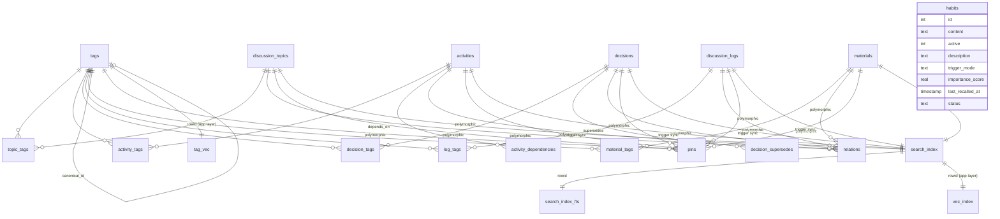

<!-- ccm-doc-sync
watch-tags: domain:cc-memory
watch-direction: true
watch-migrations: true
last-synced: 2026-07-10
last-synced-migration: 0061
-->

# cc-memory DBスキーマ v0

## 0. 読み方

本ドキュメントは cc-memory 本体（SQLite データベース）の現状スキーマを写し取ったものである。凍結を目的とせず、議論・把握のための作業用ドキュメントとして扱う。

- 一次情報は `migrations/` 配下の yoyo マイグレーションファイル全体である
- 本ドキュメントはマイグレーションを順に適用した結果として現れる**現状のスキーマ**を、テーブル単位で再構成して記述する
- 表面化していない（コード読み込みでも確認できない）事項は「未確認」と明記する
- 既知の課題は5次元統合レポートの T1（エンティティモデル & データアーキ）の指摘事実を §8 にまとめる

凡例:
- カラム NULL 列: `NO` = NOT NULL、`YES` = NULL 許容
- カラムごとの「関連 migration」は、最後にそのカラム形状を確定したファイル番号を示す
- 論理的なエンティティ名（topic / activity / decision / log / material / habit）と物理テーブル名（`discussion_topics` / `activities` / `decisions` / `discussion_logs` / `materials` / `habits`）の両方を併記する

---

## 1. 全体像

補足:
- `relations` / `pins` はポリモーフィックな多対多関係を1テーブルで束ねる。図上はエンティティ別の線で表現したが、物理的には `(source_type, source_id, target_type, target_id)` の文字列 + 整数の PK 組み合わせで識別する
- decision / log の親 topic 帰属も 0046 以降は `relations`（`relation_type='belongs_to'`）で表現する。旧 `decisions.topic_id` / `discussion_logs.topic_id` の直接 FK は 0047 で物理削除済みのため、図上に個別の辺としては描いていない（§3.3 / §3.4 / §4 参照）
- `tag_vec` / `vec_index` は sqlite-vec の仮想テーブルで、外部 FK を張れないためアプリ層で同期する
- `habits` は他エンティティ群とは独立しており、タグ・リレーション・検索インデックスのいずれにも接続していない
- 図には含めていないが、`search_telemetry`（0041）/ `citations`（0042）/ `citation_event_log`（0046）の3テーブルが 0040 以降に追加されている。いずれも既存5エンティティのライフサイクル（タグ・relations・search_index）には接続しない補助テーブルのため省略した。詳細は §2 / §3 を参照
- `session_identity` テーブルと5エンティティの `caller_session_id` カラムは 0048 で追加されたが、role-based capability gating 機構（呼び出し元の指揮層解体に伴い不要化）の撤去とあわせて 0057 で削除された

---

## 2. テーブル一覧

| 物理テーブル名 | 論理名 | 主用途 |
|---|---|---|
| `discussion_topics` | topic | 議論の器（関心事・問題・機能） |
| `activities` | activity | 作業の器（intent + status を持つ作業単位） |
| `decisions` | decision | 双方が合意した決定事項 |
| `discussion_logs` | log | 議論や作業の経緯を残す記録 |
| `materials` | material | 生成された成果物（ドラフト・分析・調査レポートなど） |
| `habits` | habit | 全セッション共通の行動ルール |
| `tags` | tag | namespace + name による分類タグ |
| `topic_tags` | — | topic ↔ tag junction |
| `activity_tags` | — | activity ↔ tag junction |
| `decision_tags` | — | decision ↔ tag junction |
| `log_tags` | — | log ↔ tag junction |
| `material_tags` | — | material ↔ tag junction |
| `relations` | — | 5エンティティ間の related 関係 + topic への belongs_to 帰属（ポリモーフィック） |
| `activity_dependencies` | — | activity 間の有向 depends_on |
| `decision_supersedes` | — | decision 間の有向 supersedes |
| `pins` | — | 任意エンティティ間の有向 pin（注意フラグ） |
| `search_index` | — | 全エンティティ統一の検索インデックス中間テーブル |
| `search_index_fts` | — | search_index と rowid 連動する contentless FTS5 仮想テーブル |
| `vec_index` | — | search_index と rowid 連動する sqlite-vec 仮想テーブル（384次元） |
| `tag_vec` | — | tags と rowid 連動する sqlite-vec 仮想テーブル（384次元） |
| `relations_view` | — | relations / activity_dependencies / decision_supersedes を統合した VIEW |
| `search_telemetry` | — | search() 呼出ごとのquery/parameters/結果件数の記録（運用計測用） |
| `citations` | — | 本文中の `{{cite:X#NNN}}` 参照の構造化保存 |
| `citation_event_log` | — | write時sanitize等のテキスト変換イベントの逐次記録（旧 sanitize_log の後継） |
| `signal_events` | signal | cc-memory自身の故障・使用感不満・矛盾検出・運用計測イベントの記録先 |

行数感（規模）はランタイム情報のため本ドキュメントでは未記載とする。

---

## 3. 各テーブル詳細

### 3.1 discussion_topics

議論トピック。1つの関心事・問題・機能を表す。

| カラム名 | 型 | NULL | デフォルト | 制約 | 説明 |
|---|---|---|---|---|---|
| id | INTEGER | NO | autoincrement | PRIMARY KEY | トピックID |
| title | VARCHAR(255) | NO | — | — | トピック名 |
| description | TEXT | NO | — | — | 説明 |
| created_at | TIMESTAMP | NO | CURRENT_TIMESTAMP | — | 作成時刻 |

補足:
- 0001 で project_id / parent_topic_id を持つ階層構造として作成されたが、0010 で両カラムとも削除された
- 親子帰属は現状もたず、トピック間関連は `relations` テーブル（`source_type='topic'`）で表現する
- caller_session_id カラムは 0048 で追加されたが、0057 で削除された（§6）

インデックス: なし（id 以外には現状張られていない）

関連 migration: 0001（新設）/ 0003（project→subject リネーム）/ 0010（subject_id, parent_topic_id 削除）/ 0048（caller_session_id 追加、のち0057で削除）

### 3.2 activities

作業の器。status を持つ。

| カラム名 | 型 | NULL | デフォルト | 制約 | 説明 |
|---|---|---|---|---|---|
| id | INTEGER | NO | autoincrement | PRIMARY KEY | アクティビティID |
| title | VARCHAR(255) | NO | — | — | タイトル |
| description | TEXT | NO | — | — | 詳細 |
| status | VARCHAR(20) | NO | `'pending'` | CHECK IN ('pending', 'in_progress', 'completed', 'snoozed', 'shelved') | 状態 |
| created_at | TIMESTAMP | NO | CURRENT_TIMESTAMP | — | 作成時刻 |
| updated_at | TIMESTAMP | NO | CURRENT_TIMESTAMP | — | 更新時刻 |
| last_heartbeat_at | TEXT | YES | — | — | 最終ハートビート時刻 |
| last_heartbeat_session_id | TEXT | YES | — | — | 直近heartbeatの書込元セッションID |
| orch_managed | BOOLEAN | NO | `0` | — | orch管轄activityかどうか（SQLiteはINTEGER affinityで0/1保持） |

補足:
- 0001 で tasks として作成され、0011 で activities にリネーム
- 0007 で `blocked` status 削除、0026 で `snoozed` 追加、0027 で `shelved` 追加
- topic_id は 0001 で存在 → 0010 で削除 → 0016 で復活 → 0021 で relations 化に伴い再削除、という往復履歴を持つ。現状は relations テーブル経由でトピックに紐づける
- last_heartbeat_session_id は 0040 で追加。自セッションのheartbeatを「別セッション扱い」と誤表示していた問題の解消用
- orch_managed は 0045 で追加。従来の素タグ `orch-managed` の存在/不在で表現していた属性を構造的カラムへ昇格したもの（同migrationで既存タグ付きactivityへの一括反映も実施）
- caller_session_id カラムは 0048 で追加されたが、0057 で削除された（§6）

インデックス:
- `idx_activities_status` ON `activities(status)`

関連 migration: 0001 / 0007 / 0010 / 0011 / 0016 / 0017 / 0021 / 0026 / 0027 / 0040（last_heartbeat_session_id）/ 0045（orch_managed）/ 0048（caller_session_id追加、のち0057で削除）

### 3.3 decisions

双方が合意した決定事項。

| カラム名 | 型 | NULL | デフォルト | 制約 | 説明 |
|---|---|---|---|---|---|
| id | INTEGER | NO | autoincrement | PRIMARY KEY | 決定ID |
| title | TEXT | YES | — | — | 表示用 title（NULL 時は decision 本文で代用） |
| decision | TEXT | NO | — | — | 決定事項本文 |
| reason | TEXT | NO | — | — | 理由 |
| created_at | TIMESTAMP | NO | CURRENT_TIMESTAMP | — | 作成時刻 |
| retracted_at | TIMESTAMP | YES | — | — | 取消し時刻（NULL=有効） |

補足:
- 0001 では topic_id が NULL 許容だったが、0005（重複番号片方）で NOT NULL 化された（`first_topic` への移行付き）。0006 で ON DELETE CASCADE 追加
- 0031 で retracted_at 導入、0037 で title 追加
- pinned カラムは 0029 で追加されたが、0034/0035 で pins テーブル化により削除された
- **`topic_id` カラムは現在存在しない**。0046 で NULLABLE 化 + FK 制約撤去、0047 で物理削除された。親 topic 帰属は `relations`（`source_type='decision', target_type='topic', relation_type='belongs_to'`）で表現する（§3.9 / §4 参照）。旧 `idx_decisions_topic_id` インデックスも 0046 で撤去済み
- caller_session_id カラムは 0048 で追加されたが、0057 で削除された（§6）

インデックス: id 以外には現状張られていない（旧 `idx_decisions_topic_id` は 0046 で撤去）

関連 migration: 0001 / 0005（topic_id NOT NULL、のち撤去）/ 0006 / 0029 / 0031 / 0035 / 0037 / 0046（topic_id NULLABLE化・belongs_to複製）/ 0047（topic_id 物理削除）/ 0048（caller_session_id追加、のち0057で削除）

### 3.4 discussion_logs

議論や作業の経緯。

| カラム名 | 型 | NULL | デフォルト | 制約 | 説明 |
|---|---|---|---|---|---|
| id | INTEGER | NO | autoincrement | PRIMARY KEY | ログID |
| title | TEXT | NO | `''` | — | タイトル |
| content | TEXT | NO | — | — | 本文 |
| created_at | TIMESTAMP | NO | CURRENT_TIMESTAMP | — | 作成時刻 |
| retracted_at | TIMESTAMP | YES | — | — | 取消し時刻 |

補足:
- 0001 では content のみ。0008 で title カラム追加 + 検索インデックス登録
- 0006 で ON DELETE CASCADE 追加
- 0031 で retracted_at 導入
- pinned カラムは 0029 で追加 → 0035 で削除
- **`topic_id` カラムは現在存在しない**（decisions と同じ経緯。0046 で NULLABLE化、0047 で物理削除）。親 topic 帰属は `relations`（`relation_type='belongs_to'`）で表現する。旧 `idx_logs_topic_id` インデックスも 0046 で撤去済み
- caller_session_id カラムは 0048 で追加されたが、0057 で削除された（§6）

インデックス: id 以外には現状張られていない（旧 `idx_logs_topic_id` は 0046 で撤去）

関連 migration: 0001 / 0006 / 0008 / 0029 / 0031 / 0035 / 0046（topic_id NULLABLE化・belongs_to複製）/ 0047（topic_id 物理削除）/ 0048（caller_session_id追加、のち0057で削除）

### 3.5 materials

成果物（ドラフト・分析結果・調査レポート等）。

| カラム名 | 型 | NULL | デフォルト | 制約 | 説明 |
|---|---|---|---|---|---|
| id | INTEGER | NO | autoincrement | PRIMARY KEY | 資材ID |
| title | TEXT | NO | — | — | タイトル |
| content | TEXT | NO | — | — | 本文 |
| source | TEXT | NO | `'unknown'` | — | 出自（どこから来た情報か） |
| created_at | TEXT | NO | `strftime('%Y-%m-%d %H:%M:%S', 'now')` | — | 作成時刻 |
| updated_at | TIMESTAMP | YES | — | — | 更新時刻（NULL 不可避：ALTER の非定数 DEFAULT 制約のため） |
| retracted_at | TIMESTAMP | YES | — | — | 取消し時刻（NULL=有効） |

補足:
- 0013 で activity_id FK 直結エンティティとして新設 → 0023 で activity_id 削除し独立エンティティ化、relations 経由で activity に紐づく構成へ
- 0029 で pinned カラム追加 → 0034 で pins テーブルへ移行 → 0035 で pinned カラム削除
- 0032 で source カラム追加、0036 で updated_at カラム追加
- retracted_at は 0043 で追加された（decision/log の retract 機構（0031）に対称化）。§6 の記載（「decision/log にのみあり material には無い」）は 0043 時点で古くなっている
- caller_session_id カラムは 0048 で追加されたが、0057 で削除された（§6）

インデックス:
- `idx_materials_activity_id`（0013で作成）は 0023 で削除済み。現状 id 以外のインデックスはない

関連 migration: 0013 / 0018 / 0023 / 0029 / 0032 / 0034 / 0035 / 0036 / 0043（retracted_at）/ 0048（caller_session_id追加、のち0057で削除）

### 3.6 habits

全セッション共通の行動ルール（旧 reminders）。

| カラム名 | 型 | NULL | デフォルト | 制約 | 説明 |
|---|---|---|---|---|---|
| id | INTEGER | NO | autoincrement | PRIMARY KEY | habit ID |
| content | TEXT | NO | — | — | 内容 |
| active | INTEGER | NO | `1` | — | 有効フラグ（1=有効） |
| created_at | TEXT | YES | `datetime('now')` | — | 作成時刻 |
| description | TEXT | NO | `''` | — | 要旨（intelligently層のマニフェスト表示に使う） |
| trigger_mode | TEXT | NO | `'always'` | CHECK IN ('always', 'intelligently') | SessionStartでの注入方式。alwaysは全文、intelligentlyはタイトルのみのマニフェストにとどめ詳細はon-demand取得 |
| importance_score | REAL | NO | `1.0` | CHECK IN (1, 2, 3) | 優先度（1=critical/2=important/3=default）。intelligently層マニフェストのソートに使う |
| last_recalled_at | TIMESTAMP | YES | — | — | `get_habits(habit_id=...)` でon-demand取得された直近時刻 |
| status | TEXT | NO | `'active'` | CHECK IN ('active', 'archived') | 棚卸し状態。active とは独立した軸で、マニフェスト取得は両方をANDで絞り込む |

補足:
- 0019 で reminders として新設、0025 で habits にリネーム
- タグ・リレーション・検索インデックス・embedding のいずれにも接続しない。事実上「設定/ポリシー」として独立
- 0058 で description / trigger_mode / importance_score / last_recalled_at を追加し、SessionStart全件全文注入からalways/intelligently分割注入に変更
- 0059 で status を追加し、intelligently層マニフェストのソートに importance_score（昇順、1が最優先）を使うよう変更
- 0060 で、0058時点の既定値1.0が新しい意味づけ（1=critical）と衝突しないよう
  trigger_mode='intelligently'かつimportance_score=1.0（未設定）のhabitを3（default）に
  補正したうえで、importance_scoreにCHECK(IN (1, 2, 3))を追加（テーブル再構築）
- 0062 で、`trigger_mode='always'` かつ `active=1` な habit の content 合計文字数が
  2000字を超えて増加する INSERT/UPDATE を `RAISE(ABORT)` で拒否するDBトリガー
  （ラチェット型天井、縮む変更は天井超過中でも常に許可）を追加。アプリ層
  （habit_service）が持つ1500字ゲートとは独立した、直接書き込み経路向けの保険

インデックス: なし

関連 migration: 0019 / 0022（初期データ追加）/ 0025 / 0058（description / trigger_mode / importance_score / last_recalled_at 追加）/ 0059（status 追加）/ 0060（importance_score データ補正 + CHECK制約追加）/ 0062（always プール合計ラチェット天井トリガー追加）

### 3.7 tags

namespace + name による分類タグ。

| カラム名 | 型 | NULL | デフォルト | 制約 | 説明 |
|---|---|---|---|---|---|
| id | INTEGER | NO | autoincrement | PRIMARY KEY | タグID |
| namespace | TEXT | NO | `''` | UNIQUE(namespace, name) | namespace（`domain` / `intent` / 空文字＝素タグ / `ow:` / `outcome:` 等） |
| name | TEXT | NO | — | UNIQUE(namespace, name) | タグ名 |
| notes | TEXT | YES | — | — | 振る舞いガイド（CLAUDE.md のタグ版） |
| description | TEXT | YES | — | CHECK(description IS NULL OR LENGTH(description) <= 100) | 短い説明（100文字以内） |
| canonical_id | INTEGER | YES | — | REFERENCES tags(id) | エイリアス先 tag ID（表記ゆれ統合用） |
| created_at | TIMESTAMP | NO | CURRENT_TIMESTAMP | — | 作成時刻 |
| archived_at | TIMESTAMP | YES | NULL | — | 退役日時。NULL は非archived |
| archived_reason | TEXT | YES | NULL | CHECK(archived_reason IS NULL OR LENGTH(archived_reason) <= 100) | 退役理由（100文字以内） |

補足:
- 0009 で新設。当初 namespace CHECK は `('', 'domain', 'scope', 'mode')`
- 0014 で `scope` を素タグに降格、`mode` → `intent` リネーム、CHECK = `('', 'domain', 'intent')`
- 0012 で notes、0015（重複番号片方）で canonical_id、0024 で description 追加
- 0039（重複番号片方 `extend_tag_namespace`）で namespace CHECK 制約自体を撤廃し、任意 TEXT を受け付ける形に再構築（妥当性は Python 層で検証）
- 0061 で archived_at / archived_reason 追加。tag notes の自動注入からは除外しつつ、
  search 等の取得系では削除せずラベル付きで下位表示するための退役フラグ
- 0063 で、notes が4000字を超えて増加する INSERT/UPDATE を `RAISE(ABORT)` で拒否する
  DBトリガー（1タグあたりのラチェット型天井、縮む変更は天井超過中でも常に許可）を追加

インデックス:
- 暗黙インデックス `UNIQUE(namespace, name)`
- `idx_tags_archived_at` ON `tags(archived_at)`（`archived_at IS NOT NULL` の部分インデックス、0061）

関連 migration: 0009 / 0012 / 0014 / 0015_tag_canonical / 0024 / 0039_extend_tag_namespace / 0061_add_tag_archived / 0063_add_tags_notes_ratchet_trigger

### 3.8 topic_tags / activity_tags / decision_tags / log_tags / material_tags

各エンティティ ↔ tag の junction table。構造は全て同型。

| カラム名 | 型 | NULL | 制約 | 説明 |
|---|---|---|---|---|
| `<entity>_id` | INTEGER | NO | REFERENCES `<entity>`(id) ON DELETE CASCADE, PK | エンティティID |
| tag_id | INTEGER | NO | REFERENCES tags(id) ON DELETE CASCADE, PK | タグID |

補足:
- `task_tags` として 0009 で作成 → 0011 で `activity_tags` にリネーム（`task_id` → `activity_id`）
- `material_tags` は 0023 で追加

インデックス:
- `idx_material_tags_tag` ON `material_tags(tag_id)`（0023）
- `idx_topic_tags_tag` / `idx_activity_tags_tag` / `idx_decision_tags_tag` / `idx_log_tags_tag` ON 各 `<junction>(tag_id)`（0049）

関連 migration: 0009 / 0011 / 0023 / 0049

### 3.9 relations

5エンティティ（topic / activity / decision / log / material）間の対称な「related」関係を1テーブルに統合したポリモーフィック関係表。

| カラム名 | 型 | NULL | デフォルト | 制約 | 説明 |
|---|---|---|---|---|---|
| source_type | TEXT | NO | — | CHECK IN ('topic','activity','material','decision','log'), PK | 起点エンティティ種別 |
| source_id | INTEGER | NO | — | PK | 起点エンティティID |
| target_type | TEXT | NO | — | CHECK IN ('topic','activity','material','decision','log'), PK | 終点エンティティ種別 |
| target_id | INTEGER | NO | — | PK | 終点エンティティID |
| relation_type | TEXT | NO | `'related'` | CHECK(relation_type IN ('related', 'belongs_to')) | 関係種別 |
| created_at | TEXT | YES | `datetime('now')` | — | 作成時刻 |

正規化制約:
- `CHECK (source_type < target_type OR (source_type = target_type AND source_id < target_id))`
- これにより重複・逆順格納が物理的に排除される

補足:
- 0033 で5つの個別 relation テーブル（topic_relations / topic_activity_relations / activity_relations / topic_material_relations / activity_material_relations）を統合し新設
- ポリモーフィック FK のため DB 側 FK 制約は張れず、CASCADE は trigger（`trg_relations_cascade_delete_*` 5本）で実現
- 0033 時点では `relation_type` は CHECK で `'related'` 固定のデッドカラムだった（depends_on / supersedes は別テーブル）
- **0046 で `relation_type` の CHECK を `('related', 'belongs_to')` に緩和**。子→親（decision/log/material/activity → topic）の帰属を表す `belongs_to` を追加し、全5エンティティの親帰属をこの1系統に統一した（旧 `decisions.topic_id` / `discussion_logs.topic_id` FK・旧 material/activity の `related` 流用を置き換え）
- `belongs_to` クエリの hot path 用に partial index を2本追加（0046）: `idx_relations_belongs_to_tgt`（子→親方向）/ `idx_relations_belongs_to_src`（親→子方向）

インデックス:
- `idx_relations_target` ON `relations(target_type, target_id)`
- `idx_relations_belongs_to_tgt` ON `relations(target_type, target_id, source_type, source_id) WHERE relation_type = 'belongs_to'`（0046）
- `idx_relations_belongs_to_src` ON `relations(source_type, source_id, target_id) WHERE relation_type = 'belongs_to'`（0046）

関連 migration: 0020（旧個別テーブル新設）/ 0023（material 系追加）/ 0033（統合）/ 0046（belongs_to 追加・partial index 2本）

### 3.10 activity_dependencies

activity 間の有向 `depends_on` 関係。

| カラム名 | 型 | NULL | デフォルト | 制約 | 説明 |
|---|---|---|---|---|---|
| dependent_id | INTEGER | NO | — | REFERENCES activities(id) ON DELETE CASCADE, PK | 依存元 |
| dependency_id | INTEGER | NO | — | REFERENCES activities(id) ON DELETE CASCADE, PK | 依存先 |
| created_at | TEXT | YES | `datetime('now')` | — | 作成時刻 |

制約:
- `CHECK (dependent_id != dependency_id)`
- 循環検出は relation_service（DFS）で実装される

インデックス:
- `idx_activity_dependencies_dependency` ON `activity_dependencies(dependency_id)`

関連 migration: 0028

### 3.11 decision_supersedes

decision 間の有向 `supersedes` 関係（新→旧）。

| カラム名 | 型 | NULL | デフォルト | 制約 | 説明 |
|---|---|---|---|---|---|
| source_id | INTEGER | NO | — | REFERENCES decisions(id) ON DELETE CASCADE, PK | 新decision |
| target_id | INTEGER | NO | — | REFERENCES decisions(id) ON DELETE CASCADE, PK | 旧decision |
| created_at | TEXT | YES | `datetime('now')` | — | 作成時刻 |

制約:
- `CHECK (source_id != target_id)`

インデックス:
- `idx_decision_supersedes_target` ON `decision_supersedes(target_id)`

関連 migration: 0033

### 3.12 pins

任意エンティティから任意エンティティへの有向 pin（注意フラグ）。

| カラム名 | 型 | NULL | デフォルト | 制約 | 説明 |
|---|---|---|---|---|---|
| source_type | TEXT | NO | — | CHECK IN ('tag','activity','topic','decision','log','material'), PK | 起点種別 |
| source_id | INTEGER | NO | — | PK | 起点ID |
| target_type | TEXT | NO | — | CHECK IN ('tag','activity','topic','decision','log','material'), PK | 終点種別 |
| target_id | INTEGER | NO | — | PK | 終点ID |
| created_at | TEXT | YES | `datetime('now')` | — | 作成時刻 |

補足:
- 0034 で新設、従来の `discussion_logs.pinned` / `decisions.pinned` / `materials.pinned` カラム機構を置き換える
- 既存 `materials.pinned=1` 行は 0034 で `(source='activity', target='material')` の形で移行
- ポリモーフィック FK のため CASCADE は trigger（`trg_pins_cascade_delete_*` 6本：topic / activity / material / decision / log / tag）で実現
- 0035 で旧 pinned カラムをすべて DROP

インデックス:
- `idx_pins_target` ON `pins(target_type, target_id)`（0038）

関連 migration: 0034 / 0035 / 0038 / 0039_extend_tag_namespace（tag trigger 再作成）

### 3.13 search_index

5エンティティ（topic / activity / decision / log / material）の検索メタ情報を統一格納する中間テーブル。本文は持たず、対応する FTS5 / vec_index は rowid（= `search_index.id`）で連動する。

| カラム名 | 型 | NULL | デフォルト | 制約 | 説明 |
|---|---|---|---|---|---|
| id | INTEGER | NO | autoincrement | PRIMARY KEY | search_index ID（= search_index_fts.rowid, vec_index.rowid） |
| source_type | TEXT | NO | — | UNIQUE(source_type, source_id) | エンティティ種別 |
| source_id | INTEGER | NO | — | UNIQUE(source_type, source_id) | エンティティID |
| title | TEXT | NO | `''` | — | 表示用 title（decisions のみ `COALESCE(title, decision)`） |
| created_at | TEXT | NO | `''` | — | 元エンティティの created_at（ソート・日付フィルタ用） |

補足:
- 0002 で新設（当初は body を持たず、search_index_fts と分離）
- 0003 で `project_id`、0009 で `subject_id` を保持していたが 0010 で削除
- 0030 で created_at カラム追加（5エンティティ分バックフィル）
- 各エンティティ側に INSERT/UPDATE/DELETE トリガーがあり、本テーブルと FTS5 仮想テーブルへ同時に書き込まれる
- vec_index は trigger 連動ではなく、アプリ層（embedding_service）が rowid 整合性を保つ

インデックス:
- `idx_search_index_source` ON `search_index(source_type, source_id)`
- `idx_search_index_created_at` ON `search_index(created_at)`（0049）

関連 migration: 0002 / 0003 / 0008 / 0010 / 0018 / 0030 / 0037 / 0049

### 3.14 search_index_fts

contentless FTS5 仮想テーブル。`search_index.id` を rowid に持ち、`title` と `body` を全文検索する。

| カラム | 説明 |
|---|---|
| title | 全文検索用 title |
| body | 全文検索用 body |

設定:
- `content=''`（contentless）
- `tokenize='trigram'`

補足:
- contentless のため `snippet()` は本文を保持しない（先頭 N 字を返すのみ、FTS マッチ位置から抽出されない）
- 全エンティティのトリガー（`trg_search_*_insert/update/delete`）が search_index と並行に FTS5 を更新する

関連 migration: 0002（新設）/ 0003 / 0004 / 0005 / 0006 / 0007 / 0008 / 0010 / 0011 / 0018 / 0026 / 0027 / 0030 / 0037（全エンティティのトリガー再生成回）

### 3.15 vec_index

sqlite-vec の vec0 仮想テーブル（384次元）。`search_index.id` を rowid に対応させてベクトル検索を行う。

| カラム | 説明 |
|---|---|
| embedding | float[384] |

補足:
- 仮想テーブルのため FK 制約不可。孤児削除はアプリ層（embedding_service）の責務
- 384次元はモデル依存（未確認: 利用モデル名はコード側に固定値）

関連 migration: 0005_add_vec_index

### 3.16 tag_vec

tags テーブル用の sqlite-vec 仮想テーブル（384次元）。tag embedding によるタグ KNN マージ判定で使われる。

| カラム | 説明 |
|---|---|
| embedding | float[384] |

補足:
- 仮想テーブルのため FK 制約不可。`tags.id` を rowid として運用するが整合性はアプリ層任せ

関連 migration: 0009

### 3.17 relations_view

`relations` / `activity_dependencies` / `decision_supersedes` を統合した読み取り専用 VIEW。

カラム:
| カラム | 説明 |
|---|---|
| source_type | 起点種別 |
| source_id | 起点ID |
| target_type | 終点種別 |
| target_id | 終点ID |
| relation_type | `'related'` / `'belongs_to'` / `'depends_on'` / `'supersedes'` のいずれか |
| created_at | 作成時刻 |

構成:
- `related` / `belongs_to`: `relations` テーブルを正方向 + 逆方向の UNION ALL で展開し、`relation_type` カラムをそのまま返す（0046 以前は `'related'` リテラル固定で返していたが、`belongs_to` 追加に伴い直接返す形に再構築された）
- `depends_on`: `activity_dependencies` をそのまま（非対称）
- `supersedes`: `decision_supersedes` をそのまま（非対称）

関連 migration: 0020（初版）/ 0023（material 系拡張）/ 0028（depends_on 追加）/ 0033（relations 統合 + supersedes 追加）/ 0046（belongs_to 対応・relation_type を直接返す形に再構築）

### 3.18 search_telemetry

search() 呼出ごとのquery/parameters/結果件数を記録する運用計測テーブル。書込は別スレッドで非同期に行い、失敗時は`logger.warning`のみでsearch本体には影響させない。

| カラム名 | 型 | NULL | デフォルト | 制約 | 説明 |
|---|---|---|---|---|---|
| id | INTEGER | NO | autoincrement | PRIMARY KEY | レコードID |
| query | TEXT | NO | — | — | 検索キーワード（str または list[str] を JSON serialize） |
| parameters | TEXT | NO | — | — | 検索パラメータ一式のJSONスナップショット |
| result_count | INTEGER | NO | — | — | 返却件数（total_count） |
| timestamp | TIMESTAMP | NO | CURRENT_TIMESTAMP | — | 書込時刻（UTC） |

インデックス:
- `idx_search_telemetry_timestamp` ON `search_telemetry(timestamp)`

関連 migration: 0041（新設）

### 3.19 citations

本文中の `{{cite:X#NNN}}`（X = M/D/L/A/T、material/decision/log/activity/topic に対応）テンプレ参照を構造化保存するテーブル。

| カラム名 | 型 | NULL | デフォルト | 制約 | 説明 |
|---|---|---|---|---|---|
| id | INTEGER | NO | autoincrement | PRIMARY KEY | レコードID |
| owner_type | TEXT | NO | — | CHECK IN ('material','decision','log','activity','topic') | 参照を含む本文のエンティティ種別 |
| owner_id | INTEGER | NO | — | — | 同上ID |
| target_type | TEXT | NO | — | CHECK IN ('material','decision','log','activity','topic') | 参照先エンティティ種別 |
| target_id | INTEGER | NO | — | — | 同上ID |
| occurrence | INTEGER | NO | — | UNIQUE(owner_type, owner_id, occurrence) | owner本文中の出現順（1始まり連番） |
| created_at | TEXT | YES | `datetime('now')` | — | 作成時刻 |

補足:
- owner削除時はtriggerでcascade削除（`trg_citations_cascade_delete_*` 5本）
- target側のretract/物理削除時はcitations行を残置する（監査トレース要件）。展開時にdangling判定を動的に行う

インデックス:
- `idx_citations_target` ON `citations(target_type, target_id)`
- `idx_citations_owner` ON `citations(owner_type, owner_id)`

関連 migration: 0042（新設）

### 3.20 citation_event_log

テキスト変換イベント（write時sanitize / bulk migration / transcript hookでのsanitize等）を1イベント1行で逐次記録するテーブル。0044で作られた集計カウンタ型`sanitize_log`（INSERT経路未実装のまま据え置き）を0046で作り直したもの。

| カラム名 | 型 | NULL | デフォルト | 制約 | 説明 |
|---|---|---|---|---|---|
| id | INTEGER | NO | autoincrement | PRIMARY KEY | レコードID |
| occurred_at | TEXT | NO | `datetime('now')` | — | イベント発生時刻（UTC） |
| source | TEXT | NO | — | CHECK IN 5値（下記） | イベントの発生経路 |
| tool_name | TEXT | YES | — | — | write_auto_convert時のMCPツール名等 |
| target_entity_type | TEXT | YES | — | CHECK IN ('decision','activity','log','material','topic') OR NULL | 対象エンティティ種別 |
| target_entity_id | INTEGER | YES | — | — | 同上ID |
| target_field | TEXT | YES | — | — | 対象フィールド名（content/title等） |
| before_text | TEXT | NO | — | — | 変換前テキスト |
| after_text | TEXT | NO | — | — | 変換後テキスト |
| verified_at | TEXT | YES | — | — | target存在チェック時刻 |
| verification_result | TEXT | YES | — | CHECK IN ('exists','dangling','skip') OR NULL | target存在チェック結果 |
| extra_json | TEXT | YES | — | — | 追加メタ情報（JSON文字列） |

source ENUM値: `write_auto_convert` / `bulk_migration` / `transcript_post_tool_use` / `transcript_session_start_backfill` / `external_doc_sanitize`

VIEW 3本（同migrationで新設）:
- `sanitize_event_log`: transcript系 + external_doc_sanitize由来（純粋なサニタイズ系）
- `auto_convert_event_log`: write_auto_convert / bulk_migration由来（自動変換系）
- `citation_event_log_by_entity`: target単位の集約（event_count, last_occurred_at）

インデックス:
- `idx_citation_event_log_target` ON `citation_event_log(target_entity_type, target_entity_id)`
- `idx_citation_event_log_source` ON `citation_event_log(source)`
- `idx_citation_event_log_occurred_at` ON `citation_event_log(occurred_at)`

関連 migration: 0044（sanitize_log として新設、forward-onlyでDROP済み）/ 0046（citation_event_logとして作り直し）

### 3.21 signal_events

cc-memory自身の故障報告・使用感不満・矛盾検出・運用計測イベントの統一記録先。decision / log とは異なり「双方の合意」も文脈タグ体系も要らない生の観測データであり、量が多く状態遷移（トリアージ）を持つ。他コンポーネント（運用計測の集計、境界判定の突合ミラー）もこのテーブルを共有し、独自テーブルは作らない。

| カラム名 | 型 | NULL | デフォルト | 制約 | 説明 |
|---|---|---|---|---|---|
| id | INTEGER | NO | autoincrement | PRIMARY KEY | シグナルID |
| kind | TEXT | NO | — | — | シグナル種別。妥当性はDB制約でなくPython層（`signal_service.KNOWN_KINDS`）で検証する |
| source | TEXT | NO | — | — | 発生源。`tool:<name>` / `hook:<name>` / `migration` / `backup` / `agent` / `user` / `gate` 等の自由文字列 |
| summary | TEXT | NO | — | — | 1行要約 |
| detail | TEXT | YES | — | — | traceback・引数ダイジェスト・自由記述 |
| refs | TEXT | YES | — | — | JSON配列 `[{"type","id"}, ...]` |
| context | TEXT | YES | — | — | JSON。kindごとの構造化ペイロード |
| fingerprint | TEXT | NO | — | — | `sha256(kind\|source\|正規化summary)` 先頭16hex。dedupキー |
| occurrence_count | INTEGER | NO | `1` | — | 同一fingerprintの再発回数 |
| first_seen_at | TIMESTAMP | NO | CURRENT_TIMESTAMP | — | 初回記録時刻 |
| last_seen_at | TIMESTAMP | NO | CURRENT_TIMESTAMP | — | 最終記録時刻（dedup時に更新） |
| session_id | TEXT | YES | — | — | 記録元セッションID |
| status | TEXT | NO | `'new'` | CHECK IN ('new','triaged','promoted','dismissed') | トリアージ状態 |
| promoted_type | TEXT | YES | — | — | 昇格先エンティティ種別（`topic`/`activity`/`decision`/`log`/`material`） |
| promoted_id | INTEGER | YES | — | CHECK `(promoted_type IS NULL) = (promoted_id IS NULL)` | 昇格先エンティティID |

補足:
- 同一 `fingerprint` を持つ `status='new'` 行が既存の場合、部分 UNIQUE インデックス（`fingerprint WHERE status='new'`）が競合を検知し、アプリ層は新規行を作らず `occurrence_count` を加算する。トリアージ済み（status が new 以外）の同型イベント再発は新規行になる
- タグ・リレーション・検索インデックス（search_index）・embeddingのいずれにも接続しない。habits と同様、事実上「観測ログ」として独立している
- `status` はライフサイクル列（§6）の `activities.status`（pending/in_progress/completed/snoozed/shelved）とは別の値集合（new/triaged/promoted/dismissed）を持つ

インデックス: `idx_signal_fingerprint_new`（UNIQUE, `fingerprint` WHERE `status='new'`）/ `idx_signal_status`（`status, last_seen_at`）/ `idx_signal_kind`（`kind, last_seen_at`）

関連 migration: 0049_add_signal_events

### 3.22 relay_outbox

セッション間通信の publish（labels routing 配布）の送信キュー（transactional outbox）。`relay_publish` ツールが INSERT し、server 内の常駐配達ループが pending 行を relay サーバーへ配達する。at-least-once 保証は本テーブルだけで閉じる（relay サーバー側は永続真実を持たない）。

スキーマの単一の真実源は relay_sdk パッケージの DDL（`relay_sdk/outbox/schema.py`、relay リポジトリからの依存パッケージ）であり、migration 0056 はそれと同一形状を migration chain に組み込んだもの。

| カラム名 | 型 | NULL | デフォルト | 制約 | 説明 |
|---|---|---|---|---|---|
| id | INTEGER | NO | autoincrement | PRIMARY KEY | outbox 行 ID（idempotency_key の生成元にも流用） |
| ref_type | TEXT | NO | — | — | 通知が指す対象の種別 |
| ref_id | TEXT | NO | — | — | 通知が指す対象の識別子 |
| labels | TEXT | NO | — | — | JSON array（配送マッチング用 labels） |
| title | TEXT | YES | — | — | 一覧表示用の見出し |
| idempotency_key | TEXT | NO | — | — | relay 側 dedup 用キー（SDK が id から自動生成） |
| created_at | TEXT | NO | — | — | ISO8601 UTC |
| processed_at | TEXT | YES | — | — | NULL = 配達待ち（pending） |
| retry_count | INTEGER | NO | `0` | — | 配達リトライ回数 |
| last_error | TEXT | YES | — | — | 直近の配達エラー |
| dead_at | TEXT | YES | — | — | NOT NULL = 配達断念（DLQ 行き。7日後に物理削除） |

補足:
- タグ・リレーション・検索インデックス（search_index）・embeddingのいずれにも接続しない。通信レイヤ専用のキューであり、cc-memoryのエンティティモデルからは独立している
- SDK 側を再同期して DDL の形状が変わった場合は、新規 migration で追従する（0056 は事後改変しない）

インデックス: `idx_relay_outbox_pending`（`id` WHERE `processed_at IS NULL AND dead_at IS NULL`。配達ループの pending 走査用の部分インデックス）

関連 migration: 0056_add_relay_outbox

---

## 4. 関係メカニズム

エンティティ間関係は5系統に分散している。それぞれ表現方法が異なる。

| # | 系統 | 物理表現 | 対称性 | 種別 | 備考 |
|---|---|---|---|---|---|
| 1 | related | `relations`（ポリモーフィック、`relation_type='related'`） | 対称（CHECK で正規化） | エンティティ間の弱い関連 | 5エンティティ全組み合わせ可 |
| 2 | belongs_to（topic 帰属） | `relations`（ポリモーフィック、`relation_type='belongs_to'`） | 親→子（子が source） | 5エンティティ全て → topic | 0046 で decision/log の旧 `topic_id` FK も含めこの1系統に統一。partial index 2本あり（§3.9） |
| 3 | depends_on | `activity_dependencies` | 非対称（dependent → dependency） | activity 間のみ | 循環検出はアプリ層 |
| 4 | supersedes | `decision_supersedes` | 非対称（新 → 旧） | decision 間のみ | 循環検出はアプリ層 |
| 5 | pin | `pins`（ポリモーフィック） | 非対称（source → target） | 任意エンティティ＋tag | 注意喚起・カタログ用 |

補足:
- 「トピックへの所属」は 0046（belongs_to 追加）/ 0047（旧 FK 物理削除）以前は (decision, log) と (activity, material) で異なる物理表現を取る非対称があったが、現在は全5エンティティが `relations.belongs_to` に統一されている（§8 の既知の課題3は解消済みとして記載更新）
- 関係系統が複数並走することは外部 API (`add_relation(relation_type=...)`) では隠蔽されているが、内部実装は系統ごとに別テーブルへ書き分ける

---

## 5. 検索インフラ

cc-memory の検索は以下3層の組み合わせで構成される。

### 5.1 search_index（中間テーブル）

5エンティティ（topic / activity / decision / log / material）を `(source_type, source_id)` で一意に識別する単一の中間テーブル。`id` カラムが FTS5 と vec_index の rowid を兼ねる。

### 5.2 search_index_fts（FTS5 全文検索）

contentless FTS5 仮想テーブル、trigram トークナイザ。`title` と `body` を全文検索する。

### 5.3 vec_index（ベクトル検索）

sqlite-vec の vec0 仮想テーブル、384次元の埋め込みを保持する。`search_index.id` と同じ rowid を共有する。

### 5.4 同期トリガー

各エンティティテーブルに INSERT / UPDATE / DELETE トリガーが定義され、search_index と search_index_fts へ同時書き込みする。テーブル定義変更（カラム追加・CHECK 制約変更）のたびにトリガーは DROP → 再 CREATE される（migration を遡ると 0002 / 0003 / 0005 / 0006 / 0007 / 0010 / 0011 / 0026 / 0027 / 0030 / 0037 / 0046（decisions/discussion_logs のtopic_id NULLABLE化に伴う再作成）と多数回再出現）。

retract 時は search_index / search_index_fts / vec_index（embedding_service経由）から該当エントリを同一SAVEPOINT内で物理削除する（`retract_service._delete_search_index_entry` + `embedding_service.delete_embedding_with_conn`）。§8 課題6(b) の「retractしてもsearch_indexの物理削除がない」という記述は古く、現在は物理削除される。

### 5.5 vec_index の整合性

vec_index は仮想テーブルのため FK 制約・トリガー連動が不可。embedding 生成・削除はアプリ層（embedding_service）でアトミックに行う規約となっている。

### 5.6 tag_vec（タグ専用 KNN）

tags テーブル用の独立 vec0 仮想テーブル。新規タグ作成時の表記ゆれ判定（KNN + 閾値）に使われる。

---

## 6. ライフサイクル列

| カラム | あるテーブル | ないテーブル | 意味 |
|---|---|---|---|
| `created_at` | 全テーブル | — | 作成時刻 |
| `updated_at` | activities / materials | topic / decision / log / habit | 更新時刻 |
| `retracted_at` | decisions / discussion_logs / materials | activities / discussion_topics / habits | 論理削除（取消し）時刻、NULL=有効 |
| `last_heartbeat_at` | activities | 他全テーブル | 最終ハートビート時刻 |
| `status` | activities | 他全テーブル | pending / in_progress / completed / snoozed / shelved |
| `active` | habits | 他全テーブル | 有効/無効フラグ（数値） |
| `caller_session_id`（廃止） | — | 全テーブル | 0048 で decisions/discussion_logs/discussion_topics/activities/materials に追加 → 0057 でcapability gating機構撤去に伴い削除済み |
| `pinned`（廃止） | — | 全テーブル | 0029 で decisions/logs/materials に追加 → 0035 で pins テーブル化により撤去済み |

補足:
- retracted_at は decision / log（0031）に加え material（0043）にもあり、topic / activity には存在しない
- retract 時は search_index / search_index_fts / vec_index を物理削除する（§5.4）ため `search()` はretract済みを自然に除外する。一方 `get_decisions` / `get_logs` 等、decisions/discussion_logs/materials テーブルを直接読む経路は search_index を経由しないため、引き続き `retracted_at IS NULL` によるフィルタが必要

---

## 7. マイグレーション履歴

| ファイル | 概要 |
|---|---|
| 0001_initial_schema | projects / discussion_topics / discussion_logs / decisions / tasks の初期5テーブル + インデックス |
| 0002_add_fts5_search | search_index + contentless FTS5 + topic / decision / task の同期トリガー新設 |
| 0003_project_to_subject | projects → subjects リネーム、project_id → subject_id、asana_url 削除、トリガー9本再作成 |
| 0004_fix_decisions_update_trigger | decision update トリガーの NULL ケース漏れバグ修正（1本 → 3本に分割） |
| 0005_add_vec_index | sqlite-vec の vec0 仮想テーブル新設（384次元） |
| 0005_decisions_topic_id_not_null | decisions.topic_id を NOT NULL 化、トリガーを再簡素化（**0005 番号重複**） |
| 0006_add_on_delete_cascade | discussion_logs / decisions の topic_id に ON DELETE CASCADE 追加 |
| 0007_remove_blocked_status | tasks.status の CHECK 制約から `blocked` 削除 |
| 0008_add_log_search_index | discussion_logs.title 追加 + 検索インデックス登録 |
| 0009_tag_infrastructure | tags / topic_tags / task_tags / decision_tags / log_tags / tag_vec 新設、subjects → domain:タグ移行 |
| 0010_remove_subjects | subjects 廃止、subject_id / parent_topic_id / tasks.topic_id カラム削除、トリガー12本書き直し |
| 0011_rename_task_to_activity | tasks → activities, task_tags → activity_tags リネーム、トリガー差し替え |
| 0012_add_tag_notes | tags.notes カラム追加 |
| 0013_add_materials | materials テーブル新設（activity_id FK 直結） |
| 0014_intent_namespace | scope: → 素タグ、mode: → intent: リネーム、intent:初期タグ投入、CHECK 制約更新 |
| 0015_intent_tag_notes | intent:* タグへ振る舞いガイド notes を投入 |
| 0015_tag_canonical | tags.canonical_id 追加（エイリアス用）（**0015 番号重複**） |
| 0016_add_activity_topic_id | activities.topic_id カラムを復活（0010 で削除されたもの） |
| 0017_add_heartbeat | activities.last_heartbeat_at 追加 |
| 0018_add_material_search_index | materials を search_index に登録、INSERT/UPDATE/DELETE トリガー新設 |
| 0019_add_reminders | reminders テーブル新設 |
| 0020_add_relation_tables | topic_relations / topic_activity_relations / activity_relations 新設 + relations_view（初版） |
| 0021_migrate_topic_id_to_relations | activities.topic_id を topic_activity_relations へ移行し、カラム削除 |
| 0022_add_detail_reminders | reminders に追加データを投入（運用ノウハウの文面） |
| 0023_material_independent_entity | material_tags / topic_material_relations / activity_material_relations 新設、materials.activity_id 削除、relations_view 拡張 |
| 0024_tag_description | tags.description 追加、intent:debug 新設、intent:* description 設定 |
| 0025_rename_reminders_to_habits | reminders → habits リネーム |
| 0026_add_snoozed_status | activities.status CHECK 制約に snoozed 追加、トリガー3本再生成 |
| 0027_add_shelved_status | activities.status CHECK 制約に shelved 追加、トリガー3本再生成 |
| 0028_add_activity_dependencies | activity_dependencies 新設、relations_view 拡張（depends_on 追加） |
| 0029_add_pinned | discussion_logs / decisions / materials に pinned BOOLEAN カラム追加 |
| 0030_add_search_index_created_at | search_index.created_at 追加 + 5エンティティ INSERT トリガー再生成 |
| 0031_add_retracted_at | decisions / discussion_logs に retracted_at 追加 |
| 0032_add_material_source | materials.source カラム追加（DEFAULT `'unknown'`） |
| 0033_relation_expansion | 旧5 relation テーブルを relations 単一テーブルに統合、decision_supersedes 新設、CASCADE トリガー5本、relations_view 再構築 |
| 0034_pins_directed_relation | pins テーブル新設、pinned=1 material を pins へ移行 |
| 0035_drop_pinned_columns | discussion_logs / decisions / materials の pinned カラム削除 |
| 0036_add_materials_updated_at | materials.updated_at 追加（既存行は created_at でバックフィル） |
| 0037_add_decisions_title | decisions.title 追加、search_index トリガーで `COALESCE(title, decision)` 表示 |
| 0038_pins_target_index_and_cascade | pins(target_type, target_id) インデックス追加、pins CASCADE トリガー6本（topic / activity / material / decision / log / tag）追加 |
| 0039_extend_tag_namespace | tags の namespace CHECK 制約撤廃（テーブル再構築）、妥当性は Python 層検証へ |
| 0039_intent_thinking | intent:thinking タグ新設、description / notes 設定（**0039 番号重複**） |
| 0040_add_heartbeat_session_id | activities.last_heartbeat_session_id 追加（自セッションheartbeatの誤表示解消） |
| 0041_add_search_telemetry | search_telemetry テーブル新設（§3.18） |
| 0042_citations_table | citations テーブル新設 + owner側cascade削除トリガー5本（§3.19） |
| 0043_add_materials_retracted_at | materials.retracted_at 追加（decision/log 同様の retract 機構を対称化） |
| 0044_sanitize_log_table | sanitize_log テーブル新設（INSERT経路未実装のまま据置。0046で作り直し） |
| 0045_add_activities_orch_managed | activities.orch_managed 追加（素タグ `orch-managed` からの構造的属性昇格 + データ移行） |
| 0046_relations_belongs_to_unify | relations.relation_type CHECK を `('related','belongs_to')` に緩和、partial index 2本追加、既存 material/activity/decision/log→topic の `related` 行を `belongs_to` に変換、decisions/discussion_logs.topic_id を relations.belongs_to へ複製したうえで NULLABLE 化・FK 削除（トリガー再作成込み） |
| 0046_sanitize_log_to_citation_event_log | sanitize_log を DROP し citation_event_log として作り直し（逐次行型 + VIEW 3本、§3.20）（**0046 番号重複**） |
| 0047_drop_decisions_logs_topic_id | decisions.topic_id / discussion_logs.topic_id カラムを物理削除（0046で確保した前提条件を受けての Contract） |
| 0048_session_identity | session_identity テーブル新設 + decisions/discussion_logs/discussion_topics/activities/materials に caller_session_id 追加（0057で全て削除） |
| 0057_drop_capability_gating | session_identity テーブル削除 + decisions/discussion_logs/discussion_topics/activities/materials の caller_session_id カラム削除（role-based capability gating機構の呼び出し元解体に伴う撤去） |
| 0058_add_habit_trigger_mode | habits に description / trigger_mode / importance_score / last_recalled_at を追加（スキーマ変更のみ、データ移行なし。trigger_modeの切り替えはupdate_habit経由で個別適用） |
| 0059_add_habit_status | habits に status（'active'/'archived'、既定'active'）を追加 |
| 0060_add_habit_importance_score_check | trigger_mode='intelligently'かつimportance_score=1.0(未設定)のhabitを3に補正したうえで、importance_scoreにCHECK(IN (1, 2, 3))を追加（テーブル再構築） |
| 0061_add_tag_archived | tags に archived_at（退役日時）/ archived_reason（退役理由、100文字以内のCHECK制約付き）を追加、archived_at 用の部分インデックス idx_tags_archived_at を新設（スキーマ変更のみ、データ移行なし） |
| 0062_add_habits_always_pool_ratchet_trigger | trigger_mode='always'かつactive=1なhabitのcontent合計文字数が2000字を超えて増加するINSERT/UPDATEをRAISE(ABORT)で拒否するトリガー2本を新設（ラチェット型天井、縮む変更は常に許可） |
| 0063_add_tags_notes_ratchet_trigger | tags.notesが4000字を超えて増加するINSERT/UPDATEをRAISE(ABORT)で拒否するトリガー2本を新設（1タグあたりのラチェット型天井、縮む変更は常に許可） |

重複番号: **0005** （add_vec_index / decisions_topic_id_not_null）、**0015** （intent_tag_notes / tag_canonical）、**0039** （extend_tag_namespace / intent_thinking）、**0046** （relations_belongs_to_unify / sanitize_log_to_citation_event_log）。yoyo は depends 宣言で順序を解決するため運用上は機能するが、ファイル名上の連番ユニーク性が崩れている。

---

## 8. 既知の課題

5次元統合レポート（material 312 / 239）の T1 エンティティモデル & データアーキ次元で指摘された事実の書き起こし。設計議論用のチェックリストとして残す。

1. **FTS5 同期トリガーの手書き重複**: 5エンティティ × 3トリガーが、スキーマ変更（CHECK 制約変更・カラム追加）のたびに DROP → 再 CREATE され、同じロジックが migration 0002 / 0003 / 0005 / 0006 / 0007 / 0010 / 0011 / 0026 / 0027 / 0030 / 0037 で10回以上重複再出現する。0004 はそのトリガーの NULL ケース漏れバグの修正であり、手書き重複がバグの温床となった事例である。

2. **decision と log の構造同型コピペ**: 両テーブルは「2テキストフィールド + retracted_at + タグ + FTS 登録」と構造同型（旧 `topic_id FK(NOT NULL)` は0046/0047で撤去され、現在は両テーブルとも relations.belongs_to 経由）。サービス層の集約取得も逐語コピペで実装されており、改修時に2箇所を同期する必要がある。

3. **〔0046/0047 で解消済み〕親子帰属表現の FK / relation 分裂**: 「トピックへの所属」という同じ意味論を、decision / log は `topic_id` FK で、activity / material は `relations` テーブルで表現する非対称がかつて存在した。0046 で `relations.relation_type` に `belongs_to` を追加し、decision/log の `topic_id` を belongs_to へ複製したうえで NULLABLE 化、0047 でカラム自体を物理削除した。現在は5エンティティ全てが `relations.belongs_to` に統一されている（§4）。

4. **関係メカニズムの5系統並走**: `relations`（related）/ `relations`（belongs_to）/ `activity_dependencies` / `decision_supersedes` / `pins` の5系統が並走する（§4）。`relations.relation_type` は0046以降 `('related', 'belongs_to')` の2値を持ち、もはやデッドカラムではない。

5. **ポリモーフィック FK 制約不可**: `relations` / `pins` / `vec_index` はポリモーフィックまたは仮想テーブルのため DB の FK 制約が張れない。CASCADE 削除は親テーブルの AFTER DELETE トリガー（relations 5本 + pins 6本）で手動実装。vec_index の孤児削除はアプリ層（embedding_service）が担う。

6. **retract / supersedes ライフサイクルの未閉鎖**: (a) supersedes（新→旧）を張っても旧 decision は自動 retract されない。(b) 〔0043 以前の記述、解消済み〕retract 時は search_index / search_index_fts / vec_index を物理削除するようになった（§5.4）。ただし decisions/discussion_logs/materials 本体の行は残るため、これらを直接読む経路（get_decisions等）は引き続き `retracted_at IS NULL` フィルタが必要。(c) 〔一部解消〕retracted_at は decision / log（0031）に加え material（0043）にもあるが、topic / activity には存在しない。

7. **habit エンティティの孤立**: habits は `content + active + created_at + description + trigger_mode + importance_score + last_recalled_at` を持つが、タグ・embedding・relation・search_index のいずれにも接続しない。他5エンティティと並べる位置づけにはなっていない。

8. **タグ解決 `resolve_tags()` のアトミック性欠如**: tag_service の `resolve_tags()` はループ内で中間 commit を行うため、複数タグ処理途中のエラーで前半 INSERT がロールバックされず中途半端な状態が残る。

9. **スキーマ進化のデザインデット**: migration 番号の重複（0005×2 / 0015×2 / 0039×2 / 0046×2）と、materials の高頻度改修（0013 / 0018 / 0023 / 0029 / 0032 / 0034 / 0035 / 0036 / 0043 / 0048 / 0057 で計11回）。

10. **`update_tag()` の単一関数4操作**: tag_service の `update_tag()` は rename / notes / canonical / description の4種を1関数に集約し if 分岐している。

---

## 9. 未確認事項

本ドキュメント作成時点でコード・migration から確証が取れなかった項目。

- 各テーブルの実 row 数感（DB 実体の統計）
- vec_index / tag_vec の384次元値が使う embedding モデル名（コード側 embedding_service に固定されている想定だが本ドキュメントでは未確認）
- 0021 で activity の topic_id を relations 化したが、relations 側に旧 topic_id 由来データが残っているかの実データ確認（コード上は INSERT OR IGNORE で移行）
